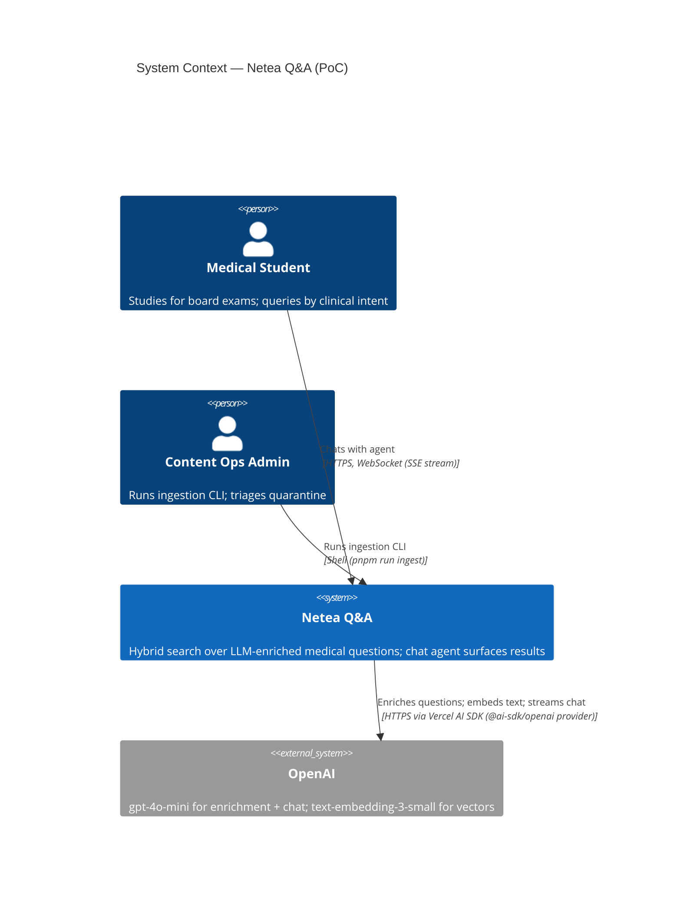
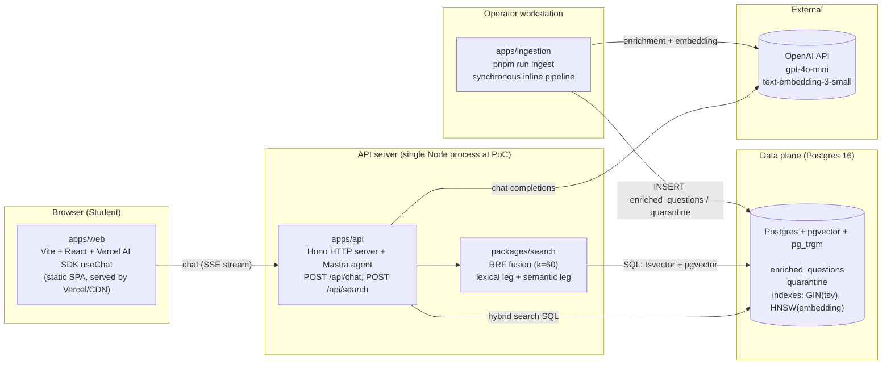
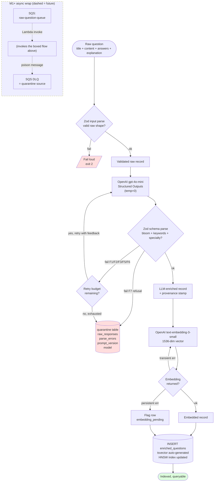
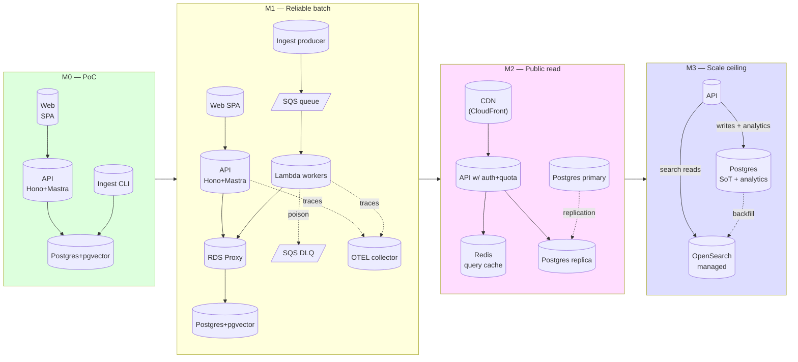
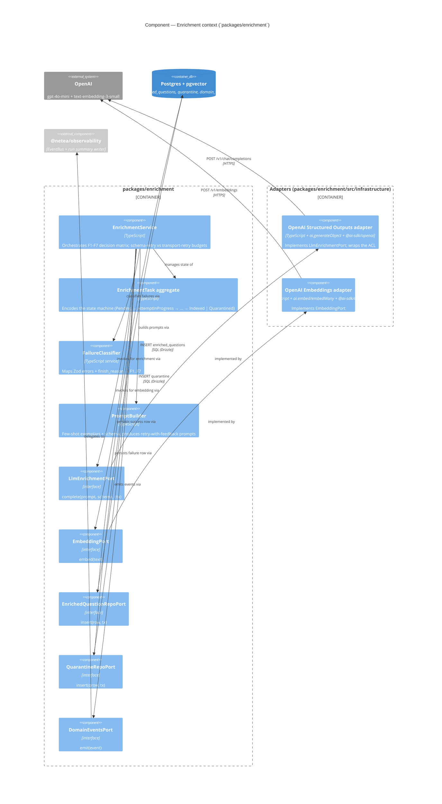
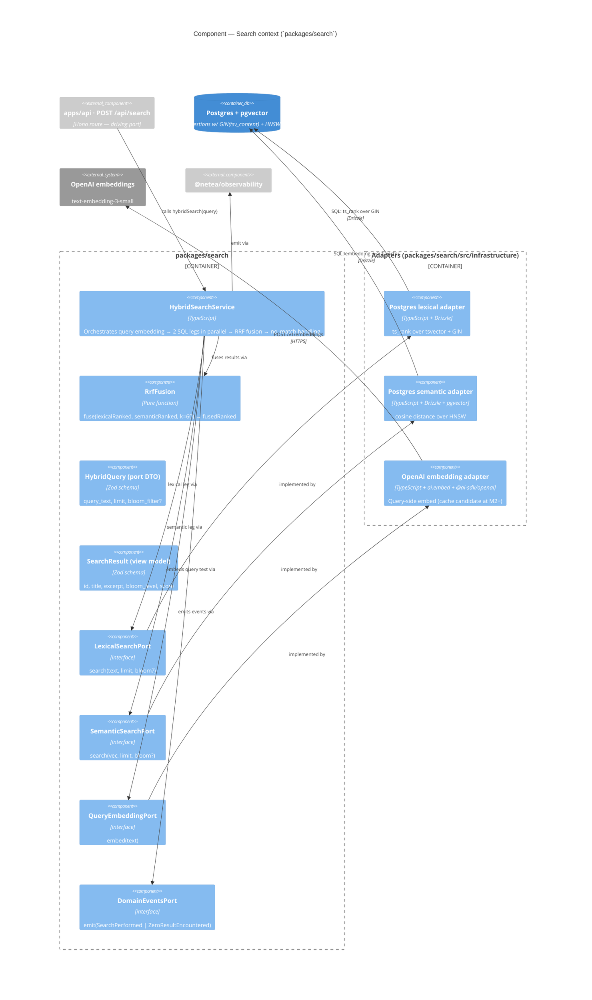

<!-- markdownlint-disable MD024 MD013 -->
# Architecture brief — `hybrid-search-medical-questions`

**Project**: Netea (Lecturio) medical-education question search
**Feature**: hybrid-search-medical-questions
**Wave**: DESIGN
**Date**: 2026-05-13
**Owner**: system-architect (this section); ddd-architect and solution-architect append below.

This file is the single SSOT for the feature's architecture. It compresses the
DIVERGE recommendation, expansion analyses, and journey artifacts into one
buy-able artifact for the stakeholder review. Diagrams are Mermaid (rendered
in any modern viewer). ADRs live next to this file under the same directory.

---

## System Architecture

### 1. C4 Level 1 — System Context

The PoC is one logical system (Netea Q&A) with two human actors and one
external SaaS dependency. The synchronous edges are user-facing; the OpenAI
edges are paid-API calls.



**Notes**:

- No second SaaS dependency at PoC (Pinecone/OpenSearch are named migration
  targets, not runtime dependencies). See ADR-001.
- Admin and student access the *same* enriched corpus; they differ in surface
  (CLI vs browser) and read/write role.

### 2. C4 Level 2 — Container diagram

The PoC ships four deployable units plus one shared package boundary. The
container shape is also the production starting shape — M1 wraps the same
inner functions in an async queue without redrawing the container map (see
Section 5).



**Edges**:

- Solid: synchronous request/response (PoC). All edges are synchronous at PoC.
- Dashed in M1+: the `Cli → OAI → Pg` path is wrapped by SQS+Lambda; see
  Section 5.

**Why this shape**:

- **Single API process** (`apps/api`): Mastra agent + search endpoint share
  one Node runtime. No internal RPC. Justified by: agent latency budget
  (Section 4) is dominated by the LLM call, not by internal IPC; splitting
  adds latency and operational overhead with no PoC benefit.
- **Single data store** (Postgres): source-of-truth + lexical index + vector
  index in one transactional store. ADR-001 captures the rationale; the
  one-line summary is "dual-store fusion has a dual-write tax we don't need
  to pay at this scale".
- **Shared `packages/search`**: lets ingestion (write side) and API (read
  side) both depend on one schema and one fusion implementation. Prevents
  drift between what we write and what we query.

### 3. Data flow diagram — one question, Raw → Indexed

The brief calls for "data flow showing async nature of AI
enrichment". At PoC, this flow is **synchronous inline** (T1 in
`diverge/options-matrix.md`); at M1, the same per-question function is
wrapped by SQS+Lambda. The diagram shows both the synchronous path (solid)
and the M1 wrap (dashed).



**Stamps applied on the indexed row** (mandatory per `feature-delta.md` System
Constraints):

- `prompt_version` (text, e.g., `"v1"`)
- `model` (text, e.g., `"gpt-4o-mini-2024-07-18"` if pinned, else floating alias)
- `model_temperature` (numeric, 0 for enrichment)
- `embedding_model` (text)
- `enriched_at` (timestamptz)
- `retry_count` (int, 0/1/2)

**Asynchrony framing**:

The PoC diagram is synchronous inline. *The async story is not absent — it is
deferred by design.* The inner per-question function (the boxed flow) is the
**unit of reuse** in M1: it becomes the body of an SQS-triggered Lambda. The
retry/quarantine semantics from Expansion A Section 3 do not change; only the
fan-out shape changes. This is the cleanest version of "design for change":
the contract at the function boundary stays; the loop around it scales.

---

### 4. Back-of-envelope estimates

All numbers cite Expansion E (cost) or KPIs in `feature-delta.md`. Where a
number is assumed, it's flagged.

#### 4.1 Per-question ingestion cost (from Expansion E §1)

Pricing assumed (Expansion E flags this): `gpt-4o-mini` input $0.15/1M, output
$0.60/1M; `text-embedding-3-small` $0.02/1M.

Token sizing (p50 / p90 from Expansion E §1):

| Component | p50 tokens | p90 tokens |
|---|---|---|
| Enrichment input (system + few-shot + question) | 1,048 | 1,524 |
| Enrichment output (JSON: bloom + keywords + specialty + rationale) | 120 | 180 |
| Embedding input (title + content + keywords) | 300 | 520 |

Single-attempt cost p50: **$0.000235 / question**.

Effective cost factoring in retry distribution (Expansion E §1 weighted
attempts ≈ 1.30): **$0.000304 / question** (~$0.30/1k).

At corpus scales:

| Corpus | Effective ingest cost (one-shot) |
|---|---|
| 10 (PoC seed) | < $0.01 |
| 10,000 | ~$3.04 |
| 100,000 | ~$30.36 |
| 1,000,000 | ~$303.60 |

All well below KPI #7 budget guardrail of **<$10/1k**.

#### 4.2 Per-question ingestion latency budget

Measured / estimated:

| Operation | p50 | p95 |
|---|---|---|
| OpenAI `gpt-4o-mini` enrichment call (1k tokens in, 120 tokens out, streamed) | ~900 ms | ~1.4 s |
| Zod parse + retry decision (in-process) | <1 ms | <5 ms |
| OpenAI `text-embedding-3-small` (300 tokens) | ~150 ms | ~300 ms |
| Postgres INSERT (with HNSW index update on a 10k corpus) | ~5 ms | ~30 ms |
| Postgres tsvector generation (auto-generated column) | <1 ms | <5 ms |
| **End-to-end (single question, no retry)** | **~1.06 s** | **~1.74 s** |

KPI from US-01: p95 end-to-end ingest < 8s. Budget headroom is ~6.3s for the
worst case (2 retries + slow embedding). Comfortable.

#### 4.3 Search latency budget (KPI: p95 < 500ms; US-04 §AC: p95 < 800ms for DB portion)

Per-query operations:

| Operation | p50 | p95 |
|---|---|---|
| Query embedding via OpenAI (~30 tokens) | ~80 ms | ~200 ms |
| Postgres lexical query (GIN over tsvector on 10k rows, top-20) | ~5 ms | ~15 ms |
| Postgres semantic query (HNSW cosine, top-20) | ~2 ms | ~10 ms |
| RRF fusion in app (k=60, 40-row merge) | <1 ms | <2 ms |
| Network round-trip to Postgres (local) | ~1 ms | ~3 ms |
| **End-to-end `/api/search`** | **~90 ms** | **~230 ms** |

Verdict: p95 < 500 ms KPI is met with ~270 ms headroom at 10k rows. At 1M
rows, pgvector HNSW latency rises modestly (AWS-measured ~1.5 ms single-query
on representative data per `options-matrix.md` §sources); the budget still
holds. Above ~5M rows, embedding-call latency still dominates the DB query
and search-time embedding caching becomes the right lever.

The query-embedding call (the dominant cost) is a candidate for **caching by
query-hash** at M2: short circuits the 80-200ms hot path for repeated queries.

#### 4.4 Chat agent latency budget (KPI: p95 < 4s for first useful response)

A single chat turn:

| Operation | p50 | p95 |
|---|---|---|
| Agent system prompt + tool definitions + history → LLM input (~2,500 tokens) | (in tokens, not latency) | — |
| First-token latency from `gpt-4o-mini` | ~600 ms | ~1.2 s |
| Tool decision streamed; `search_questions` tool invoked | <50 ms | <100 ms |
| `/api/search` end-to-end (§4.3) | ~90 ms | ~230 ms |
| LLM resumes with tool results, streams response (~250 output tokens) | ~1.0 s | ~2.0 s |
| **First useful agent token → user** | **~750 ms** | **~1.4 s** |
| **Full response** | **~1.8 s** | **~3.5 s** |

Verdict: p95 < 4 s KPI is met. The streaming contract (Vercel AI SDK useChat)
means the user *perceives* responsiveness at first-token latency (~750 ms
p50), not full-response latency. This is the difference between "feels fast"
and "is fast" and matches the journey artifact's "engaged" emotional state
exit at Step 2.

#### 4.5 Storage estimates

Per enriched row (Postgres internal size, conservative):

| Column | Bytes (avg) | Bytes (p90) |
|---|---|---|
| id (uuid) | 16 | 16 |
| title, content, explanation (text) | ~1,500 | ~3,000 |
| answers (jsonb, 5 options) | ~400 | ~700 |
| keywords (text[] of ~5 items) | ~80 | ~140 |
| bloom_level, medical_specialty (text) | ~30 | ~50 |
| embedding (vector(1536) at float32) | **6,144** | 6,144 |
| tsvector (generated, indexed) | ~600 | ~1,200 |
| provenance columns | ~80 | ~120 |
| **Per-row total** | **~8,850** | **~11,370** |

Storage at three scales (data + HNSW index ~2× row size; total ~3× row size):

| Corpus | Raw rows | HNSW index | Total (incl. tsvector GIN, ~10% of row size) |
|---|---|---|---|
| 10 (PoC) | ~90 KB | ~180 KB | ~300 KB |
| 10,000 | ~88 MB | ~177 MB | ~290 MB |
| 100,000 | ~885 MB | ~1.77 GB | ~2.9 GB |
| 1,000,000 | ~8.85 GB | ~17.7 GB | ~29 GB |

Verdict: at 1M rows the corpus + indexes fit on a `db.t4g.medium` RDS
instance comfortably (16 GB RAM, 100 GB SSD). At 5M rows we cross into
needing a `db.t4g.xlarge` or similar, and HNSW memory pressure becomes the
trigger for the M3 migration to OpenSearch (ADR-001).

#### 4.6 Throughput at M1 (10k–100k corpus, SQS+Lambda async)

| Dimension | Number | Source |
|---|---|---|
| Per-Lambda enrichment rate (limited by OpenAI call latency, ~1.4 s p95) | ~0.7 calls/s/Lambda | §4.2 |
| Practical Lambda concurrency at M1 (limited by RDS connection pool) | 10–20 | ADR-003, Risk R-09 below |
| Aggregate steady-state ingestion rate | ~10–14 questions/s | Concurrency × per-Lambda rate |
| Time to re-enrich 100k corpus | ~2 hours | 100k / 14 q/s |
| Time to re-enrich 1M corpus | ~20 hours | Within Expansion E "drain within 7 days" ceiling |
| OpenAI Tier-2 rate limit ceiling (typical) | 5,000 RPM enrichment | OpenAI tier limits at time of writing |
| OpenAI Tier-2 ceiling consumed at 14 q/s | ~840 RPM (17% of ceiling) | Comfortable headroom |

Verdict: SQS+Lambda at M1 reaches 100k re-enrichment in a coffee-break and
1M overnight, well under the Expansion E §4 7-day drain ceiling. The bottleneck
is the **RDS connection pool** (Risk R-09 below), not OpenAI rate limits, and
that's why ADR-003 calls for RDS Proxy at M1 instead of direct connections.

---

### 5. Scaling story (the roadmap deliverable B)

Four milestones. Each names what's in scope, the trigger to move to the next,
and the migration path. No milestone forces a rewrite — every transition is
additive or substitutive at a single boundary.

#### M0 — PoC (current)

**Scope**:

- Synchronous inline ingestion CLI (`pnpm run ingest`). 10 questions.
- Single Node API process: Hono + Mastra agent. `POST /api/search`, `POST /api/chat`.
- Single Postgres instance (local Docker at dev, single RDS/Neon at deploy).
- pgvector + tsvector + pg_trgm. HNSW index on embeddings, GIN on tsvector.
- Application-side RRF fusion (`k=60`).
- Vite+React SPA with Vercel AI SDK `useChat`.
- Structured logs to stdout. `logs/runs/{batch_id}.json` per ingestion run.
- No auth. No multi-tenancy.

**Why it's enough**: matches every PoC KPI in `feature-delta.md`. Comfortable
headroom on every back-of-envelope budget in §4.

**Trigger to leave M0**: ≥100 questions per batch causes serial ingest to feel
slow (>2 min); OR 2+ stakeholders want to access ingestion concurrently; OR
first real user-facing deploy.

#### M1 — Reliable batch (~100k questions, internal use)

**Additions**:

- Async ingestion via **AWS SQS + Lambda workers** (ADR-003). `SQS DLQ` becomes
  the quarantine source-of-truth for transport-poisoned messages; the existing
  `quarantine` table remains the source-of-truth for schema-failed messages.
  Both inspectable from one operator surface.
- **RDS Proxy** in front of Postgres (Risk R-09): prevents Lambda fan-out from
  exhausting the connection pool. Critical infra at this milestone.
- **Idempotency keys** on enrichment writes (Risk R-08): SQS at-least-once
  delivery + `INSERT ... ON CONFLICT (source_question_id, prompt_version) DO
  NOTHING` makes retries safe.
- **OTEL traces + Prometheus metrics** (ADR-004): traces for LLM calls,
  Postgres queries, agent tool-call graph; metrics for first-try-pass rate,
  retry-count distribution, quarantine rate, cost-per-batch — all sliceable
  by `prompt_version` and `model` per Expansion A §6.
- **`prompt_version`-aware re-enrichment job**: lazy policy (Expansion E §4);
  driven by `needs_reenrichment` column.
- **Basic API auth**: bearer token or AWS IAM for the search/chat endpoints
  (internal-only; not yet student-facing).
- **Postgres read replica** (optional at this stage; mandatory at M2).

**Trigger to leave M1**: first student-facing deploy is approved; OR sustained
read QPS > 50 req/s; OR multi-tenant requirements arrive.

**Migration path M0→M1**:

1. Extract the inline `enrich(question)` function into `packages/enrichment`.
   No semantic change; just a module boundary.
2. Add a thin SQS-producing CLI alongside the existing one: same input file,
   different consumer. The synchronous CLI remains as a fallback.
3. Deploy Lambda(s) consuming from SQS, calling the same `enrich(question)`
   function. DLQ wired.
4. Cut over by changing default ingest CLI to the producer mode. Synchronous
   path stays around for emergency replays.

#### M2 — Public read (~1M questions, student-facing)

**Additions**:

- **API auth + quotas** per student session: rate limit per IP/token (Risk
  R-10: API quota exhaustion at student burst). Token bucket in front of
  `/api/chat`.
- **Postgres read replicas** (mandatory): split read traffic from write path.
  Search/chat read from replica; ingestion writes to primary.
- **Search-result caching**: query-hash → result-ids in Redis (or Postgres
  `unlogged` table). Cuts the OpenAI query-embedding latency (§4.3) for
  repeated queries. TTL 1 hour; invalidated on prompt_version bump.
- **CDN for `apps/web`**: static SPA served from CloudFront / Vercel edge.
- **Per-tenant `medical_specialty` partitioning** of the `enriched_questions`
  table (if multi-tenant). Postgres declarative partitioning.

**Trigger to leave M2**: corpus crosses 5M rows (HNSW memory pressure begins);
OR sustained KPI #3 (retrieval relevance ≥ 80%) at scale drops below
threshold; OR multi-region read latency requirements arrive.

**Migration path M1→M2**:

1. Add a read-replica RDS instance; point search/chat reads at it via
   connection-string config (no code change to `packages/search`).
2. Add Redis (ElastiCache) for query-result cache; wrap `/api/search` with a
   cache-aside helper.
3. Add per-tenant scope to the search SQL — additive `WHERE tenant_id = ?`
   in the existing query.

#### M3 — Scale ceiling (corpus >5M OR KPI #3 <80% at scale)

**Decision point**: migrate Postgres+pgvector → **OpenSearch managed (ADR-001
named exit)**. The pre-conditions to fire this milestone are objective and
measurable, not vibes.

**Substitution shape**:

- The `packages/search` module exposes a `Searcher` interface (DDD-architect
  to ratify). The pgvector implementation moves behind one adapter; an
  OpenSearch implementation is added behind another.
- A backfill job exports `enriched_questions` to OpenSearch (BulkAPI). Postgres
  remains source-of-truth.
- Behind the API, search reads flip to OpenSearch; Postgres reads continue to
  serve admin/curriculum-analytics SQL (Expansion C, M1-M3 BI views).
- This is **substitution, not rewrite**: the application API surface
  (`POST /api/search`) doesn't change.

**Migration path M2→M3** (sketch; DESIGN at the time):

1. Stand up OpenSearch managed cluster.
2. Backfill `enriched_questions` → OpenSearch via bulk indexing.
3. Dual-write at ingestion (Postgres primary + OpenSearch replica) for
   validation window.
4. Flip search reads to OpenSearch. Validate KPI #3 + KPI on latency.
5. Retire pgvector index (drop HNSW) but keep `embedding` column in Postgres
   for analytics / re-export.

#### Comparative deployment topology



---

### 6. System-level ADRs

Five ADRs live alongside this brief. Each captures one infrastructure
decision in the standard Status/Context/Decision/Consequences/Alternatives/
Migration format.

| ID | Title | Status |
|---|---|---|
| [ADR-001](./adr-001-search-backend.md) | Search backend: Postgres + pgvector with OpenSearch as named exit | Accepted |
| [ADR-002](./adr-002-ingestion-topology.md) | Ingestion topology: synchronous inline at PoC, async-pool at M1 | Accepted |
| [ADR-003](./adr-003-async-queue-infrastructure.md) | Async queue infrastructure: AWS SQS + Lambda at M1 | Accepted (for M1) |
| [ADR-004](./adr-004-observability-strategy.md) | Observability strategy: stdout JSON at PoC, OTEL+Prom at M1+ | Accepted |
| [ADR-005](./adr-005-embedding-model.md) | Embedding model: text-embedding-3-small (1536-dim) | Accepted |
| [ADR-006](./adr-006-aggregates-with-events-no-event-sourcing.md) | Aggregates with emitted events, no event sourcing (domain-level) | Accepted |

---

### 7. Risk register additions (system-level)

The DISCUSS feature-delta already has a risk register covering LLM
non-determinism, prompt drift, hybrid ranking, budget overrun, and demo
connectivity. This section adds the **infrastructure-level** risks that the
system architect surfaces. Format: probability × impact + named mitigation +
tripwire metric.

| # | Risk | Prob × Impact | Mitigation | Tripwire |
|---|---|---|---|---|
| **R-07** | **pgvector HNSW index rebuild cost at scale** — adding/changing index parameters (`m`, `ef_construction`) on a populated index requires a rebuild. At 1M rows the rebuild can take 30+ minutes and locks writes during the operation. | Med × High (at >100k rows) | (a) Pick HNSW parameters once (`m=16, ef_construction=200`) per pgvector recommended starting point; (b) any future change runs as a `CREATE INDEX CONCURRENTLY` on a side index, swap names atomically; (c) document the rebuild playbook with timing estimates per corpus size. | `pg_stat_user_indexes` shows index size growth >2× expected; HNSW build time on a sample exceeds 30 min at current scale. |
| **R-08** | **SQS at-least-once delivery → duplicate enrichment writes** — every SQS message may be delivered 2+ times. Without idempotency, the same question is enriched twice (paying the LLM bill twice and writing two rows). | High × Med (at M1+) | Idempotency key = `(source_question_id, prompt_version)`. DB-side: `INSERT ... ON CONFLICT DO NOTHING` on the unique key. Application-side: the enrichment function is a pure function of `(question, prompt, model)` so re-execution is safe. | Postgres `pg_stat_user_tables.n_tup_dup_ins` on `enriched_questions` exceeds 0.1% of total inserts. |
| **R-09** | **Postgres connection pool exhaustion under Lambda fan-out** — Lambda's default concurrency (~1000) × open Postgres connections per Lambda (≥1) = connection storm that exhausts RDS's max_connections (~100-200 default). | High × High (at M1+) | **RDS Proxy** in front of Postgres at M1 (ADR-003). Sets a hard ceiling on connections from the Lambda fleet by pooling. Documented in M1 scope. | RDS metric `DatabaseConnections` ≥ 80% of max for >5 minutes; or `connection refused` errors in Lambda logs. |
| **R-10** | **OpenAI rate-limit (429) cascade under burst load** — sudden ingestion burst (re-enrichment of 100k corpus) saturates the OpenAI rate limit. Naive retry storms make it worse. | Med × Med | Token-bucket on the *producer* side (rate-limit before submitting to SQS); separate schema-retry vs transport-retry budgets (Expansion A §3); exponential backoff with jitter; surface 429-rate as a metric. | OpenAI `x-ratelimit-remaining-requests` header < 10%; or 429 rate > 1% in any 5-minute window. |
| **R-11** | **Embedding model deprecation** — OpenAI EOL'd `text-embedding-ada-002` in 2024-25 with ~12 months notice. `text-embedding-3-small` will eventually face the same fate. All stored vectors become unqueryable on switchover until re-embedded. | Low × Critical | (a) Pin the `embedding_model` on every row (Expansion A §4); (b) document the corpus-re-embed playbook (it's the same 5-stage migration as prompt-v1→v2 in Expansion E §5, applied to the embedding column); (c) monitor OpenAI deprecation announcements; (d) ADR-005 names the migration path. | OpenAI announces deprecation; OR alternative-model evaluation shows >5pp improvement on retrieval relevance (KPI #3). |
| **R-12** | **Cost runaway from accidental re-runs** — operator runs `pnpm run ingest` against a 100k file by mistake; OpenAI bill spikes; no early-abort gate. | Med × High | (a) Per-run cost cap with hard abort (Expansion E §6); default `INGEST_MAX_COST_USD=5.00`; (b) confirmation banner before runs against files >100 questions; (c) daily token budget in production (M2+) with 80%/100% alerts; (d) `--dry-run` flag that estimates cost without spending. | Per-run cost exceeds 80% of cap; OR daily token budget crosses 50% before 12:00 UTC. |

These risks add to (do not replace) the application-level risks in
`feature-delta.md` §Risk register. The DDD architect and solution architect
may surface additional risks in their respective sections.

---

### 8. Open issues

These are flaws or tensions surfaced during the system-architecture pass that
deserve stakeholder clarification. None justify reopening a locked
decision; all are worth a defensible position.

1. **HNSW index parameters are stated but not benchmarked**. We commit to
   `m=16, ef_construction=200` per pgvector recommended starting points. We
   have not measured recall@k on the actual seed corpus. For 10 questions
   this is moot; for the first 10k batch it should be empirically validated
   against KPI #3 (retrieval relevance ≥ 80%).

2. **The PoC's "no auth" stance leaks into the API contract**. If we ship M0
   to a publicly reachable URL for the demo, *anyone* can hit `/api/chat`
   and burn through the OpenAI key. The PoC scope explicitly excludes auth,
   but the demo-time mitigation (set `OPENAI_API_KEY` to a low-rate-limit
   dev key; only run during the demo window) should be stated explicitly.

3. **RRF k=60 is a universal default, not a tuned parameter**. We commit to
   k=60 (the value Elasticsearch, OpenSearch, and Qdrant all settled on per
   `options-matrix.md` sources). On the 10-question PoC corpus this cannot
   be tuned. The honest framing: "k=60 is a defensible default; tuning is a
   post-launch experimentation activity gated on having a labeled retrieval
   eval set". Named here so the assumption is explicit.

4. **Synchronous chat agent path is a soft SPOF**. The single Node process
   running Mastra + Hono is a SPOF for `/api/chat`. At PoC scale this is
   correct; at M2 (public read) we'd run multiple stateless API instances
   behind a load balancer. Named here so M2 isn't a surprise.

5. **The Mastra tool-result schema for `{results:[], reason:"no_match"}` is
   assumed expressible** (per `diverge/recommendation.md` §5b). DESIGN's
   solution-architect should verify this against Mastra's tool-result typing
   before DELIVER builds against it. If Mastra can't express the
   structured-empty distinction cleanly, US-07 needs an alternative.

---

## Domain Model

This section is the DDD architect's output. It models four bounded contexts,
their aggregates, the domain events emitted between them, the ubiquitous
language, and the integration patterns at the seams. Stack and infrastructure
decisions belong to the system-architect section above and are not re-litigated
here.

The domain is modeled with **aggregates + emitted domain events**. **Event
sourcing is explicitly NOT used**; Postgres rows remain source-of-truth. Events
are emitted as "facts that happened" for observability (US-03) and downstream
integration, but never replayed to reconstruct state. The defense of this
choice is in §Domain Model 7 below.

---

### Domain Model 1 — Bounded context map

The feature decomposes into four bounded contexts. The split follows
**language divergence** and **organizational ownership**: the word "Question"
means something different in each context (a raw input record, an enrichment
work-item, a searchable row, an agent-tool result). Where the language differs,
the boundary follows.

```mermaid
flowchart TB
    subgraph Personas["Actors"]
        Admin(["Sam<br/>(content-ops-admin)"])
        Student(["Priya<br/>(medical-student)"])
    end

    subgraph Ingestion["Ingestion Context<br/>(Supporting subdomain)"]
        IngestAgg["Aggregates:<br/>- Question<br/>- IngestionBatch"]
    end

    subgraph Enrichment["Enrichment Context<br/>(CORE subdomain)"]
        EnrichAgg["Aggregates:<br/>- EnrichmentTask<br/>- Quarantine"]
    end

    subgraph Search["Search Context<br/>(CORE subdomain)"]
        SearchAgg["Read model only:<br/>- HybridQuery (port)<br/>- no write aggregate"]
    end

    subgraph Conversation["Conversation Context<br/>(Supporting subdomain)"]
        ConvAgg["Aggregates:<br/>- ConversationSession<br/>  (in-memory, PoC)<br/>- ChatTurn<br/>  (transient, PoC)"]
    end

    subgraph Postgres[("Postgres + pgvector<br/>(shared kernel for storage)")]
        PgWrite[("Write side:<br/>enriched_questions<br/>quarantine<br/>ingestion_batches")]
        PgRead[("Read side:<br/>tsvector GIN +<br/>HNSW(embedding)")]
        PgWrite -.->|"same rows"| PgRead
    end

    subgraph External["External services"]
        OAI[("OpenAI<br/>gpt-4o-mini + embeddings")]
    end

    Admin -->|"runs ingest CLI<br/>Command: IngestBatch"| Ingestion
    Ingestion -->|"Command: EnrichQuestion<br/>(in-process call at PoC,<br/>SQS at M1)"| Enrichment
    Enrichment -->|"Customer-Supplier<br/>writes to"| PgWrite
    Enrichment -->|"ACL: AI SDK generateObject<br/>+ Zod validation<br/>+ retry policy"| OAI
    Ingestion -->|"writes raw shape to"| PgWrite

    Student -->|"chats with agent<br/>Command: SendChatMessage"| Conversation
    Conversation -->|"Customer-Supplier<br/>tool call: HybridSearch"| Search
    Conversation -->|"Conformist<br/>uses OpenAI streaming"| OAI
    Search -->|"reads from"| PgRead

    style Enrichment fill:#fdd,stroke:#900,stroke-width:2px
    style Search fill:#fdd,stroke:#900,stroke-width:2px
    style Ingestion fill:#dfd
    style Conversation fill:#dfd
    style Postgres fill:#ffd
    style External fill:#eef
```

**Legend**:

- Red borders = **CORE** subdomain (where competitive differentiation lives).
- Green = **Supporting** subdomain (necessary, not differentiating).
- Postgres is a **Shared Kernel** at PoC scope (deliberate simplification —
  see Domain Model 5).
- OpenAI is wrapped by an **Anti-Corruption Layer** in Enrichment (Zod parse +
  retry/quarantine policy) and a **Conformist** relationship in Conversation
  (Mastra agent conforms to OpenAI's streaming model).

#### 1.1 — Ingestion context

**Responsibility**: Owns the lifecycle of a `Question` from raw input
(JSON file) to "ready for enrichment". Validates input shape (Zod parse of
the raw question schema). Groups questions into an `IngestionBatch` for
run-level observability (US-03). Hands off validated questions to the
Enrichment context.

**It does NOT own**: LLM calls, embedding generation, search ranking, or
chat. It does not stamp `prompt_version` (that belongs to Enrichment because
prompt_version describes *the enrichment*, not *the input*).

**Aggregates**: `Question` (lifecycle root), `IngestionBatch` (cohort root).
See Domain Model 2.

**Domain events published OUT**:

| Event | Payload sketch |
|---|---|
| `QuestionIngested` | `{ question_id, batch_id, title, raw_input_hash, ingested_at }` |
| `QuestionValidationFailed` | `{ raw_input_id, batch_id, zod_errors, raw_payload, failed_at }` |
| `BatchOpened` | `{ batch_id, file_path, expected_count, prompt_version, model, started_at }` |
| `BatchClosed` | `{ batch_id, total, enriched, quarantined, duration_ms, total_cost_usd, closed_at }` |

**Commands accepted IN** (from CLI driving port):

| Command | Payload |
|---|---|
| `IngestBatch` | `{ file_path, dry_run?, max_cost_usd? }` |
| `IngestOne` | `{ raw_question_payload }` (used by US-01 walking skeleton) |

**External dependencies**:

- Filesystem (JSON file) — driving adapter.
- Postgres (`ingestion_batches` table) — **Shared Kernel** with Enrichment.
- Enrichment context — **Customer-Supplier** (Ingestion is upstream
  customer; Enrichment is downstream supplier of "enriched question"
  capability). Synchronous in-process call at PoC.

#### 1.2 — Enrichment context (CORE)

**Responsibility**: Owns the enrichment of a validated `Question` with
LLM-generated metadata (bloom_level, keywords, medical_specialty, optional
rationale) and the embedding vector. Owns the **failure containment policy**
of Expansion A §3: the F1-F7 failure taxonomy is implemented entirely
within this context's bounded behaviour. Owns the `Quarantine` aggregate
for records that exhaust the schema-retry budget. Stamps provenance
(`prompt_version`, `model`, `model_temperature`, `embedding_model`,
`enriched_at`, `retry_count`) on every enriched row.

This is the **core** of the system — the place where competitive
differentiation lives (the retry policy, the quarantine discipline, the
provenance contract). Every other context is in service of, or downstream
of, this one.

**It does NOT own**: search ranking, chat-turn management, raw input
validation (Ingestion's job).

**Aggregates**: `EnrichmentTask` (one attempt to enrich one Question;
embodies the F1-F7 decision matrix), `Quarantine` (failed enrichments
awaiting human review). See Domain Model 2.

**Domain events published OUT**:

| Event | Payload sketch |
|---|---|
| `EnrichmentAttempted` | `{ task_id, question_id, attempt_number, prompt_version, model, started_at }` |
| `EnrichmentSucceeded` | `{ task_id, question_id, bloom_level, keywords, medical_specialty, retry_count, tokens_in, tokens_out, cost_usd, prompt_version, model, enriched_at }` |
| `EnrichmentRetryScheduled` | `{ task_id, question_id, attempt_number, failure_kind (F1-F7), zod_errors, backoff_ms }` |
| `EnrichmentQuarantined` | `{ quarantine_id, question_id, batch_id, raw_responses[], parse_errors[], failure_kind (F1-F7), prompt_version, model, quarantined_at }` |
| `EmbeddingGenerated` | `{ question_id, embedding_model, embedding_dim, vector_norm, tokens_used, cost_usd, embedded_at }` |
| `QuestionIndexed` | `{ question_id, batch_id, prompt_version, indexed_at }` (terminal happy-path event) |

`EnrichmentQuarantined` semantically carries the **last** validation error
from Zod for human inspection, and also the `failure_kind` per Expansion A's
F1-F7 taxonomy. This is the load-bearing event for US-02's quarantine triage
UX and for US-03's observability slicing by `failure_kind`.

**Commands accepted IN**:

| Command | Payload |
|---|---|
| `EnrichQuestion` | `{ question_id, raw_payload, batch_id, prompt_version, model }` |
| `MarkForReEnrichment` | `{ question_id, reason }` (sets `needs_reenrichment = true`; Expansion E §4) |

**External dependencies**:

- **OpenAI** — wrapped in an **Anti-Corruption Layer**. The ACL is exactly
  the five-layer defense from Expansion A §2: prompt-side, transport-side
  (Structured Outputs), validation-side (Zod), recovery-side (feedback
  retry), quarantine-side. The AI SDK's vocabulary (`generateObject`, `embed`,
  `finish_reason`, tokens) never leaks into the rest of the system; it is
  translated into our vocabulary (`EnrichmentAttempted`, `failure_kind`,
  `cost_usd`).
- **Postgres** (`enriched_questions`, `quarantine`) — **Shared Kernel**.
  Enrichment writes; Search reads. Read/write split discussed in
  Domain Model 5.

#### 1.3 — Search context (CORE)

**Responsibility**: Owns hybrid retrieval — combining the lexical leg
(Postgres tsvector + GIN, weighted by `setweight`) with the semantic leg
(pgvector HNSW cosine similarity) via **Reciprocal Rank Fusion (k=60)**.
Owns the `HybridQuery` driving port and the `SearchResult` view model.
Translates the "no results" case into the structured `{ results: [],
reason: "no_match" }` shape that US-07 depends on.

**It does NOT own**: question enrichment, agent reasoning, chat history,
embedding generation at ingest time (Enrichment owns that). It DOES own
query-time embedding generation, because that's part of executing the
semantic leg.

**Aggregates**: **None for write side**. This is a **query-only context**.
The Search context is best modeled as a set of port interfaces over the
read side of Postgres, plus a stateless `RrfFusion` domain service.
Treating `SearchQuery` as an aggregate would be a category error — there
is no consistency boundary, no lifecycle, no invariants beyond the input
DTO's shape. The honest framing: **Search is a read context, not a write
context**.

See Domain Model 2 for the read-model view.

**Domain events published OUT**:

| Event | Payload sketch |
|---|---|
| `SearchPerformed` | `{ search_id, query_text, bloom_filter?, result_count, lexical_top_k, semantic_top_k, fused_top_k, latency_ms, query_embedding_tokens, query_embedding_cost_usd, performed_at }` |
| `ZeroResultEncountered` | `{ search_id, query_text, bloom_filter? }` (downstream: Conversation's reformulation logic for US-07) |

`SearchPerformed` is emitted for **every** search (with `result_count >= 0`)
so observability captures both success and zero-result cases. The
`ZeroResultEncountered` event is a derived signal — emitted when
`result_count == 0` — that the Conversation context can subscribe to for
the US-07 reformulation flow.

**Commands accepted IN** (from API driving port):

| Command | Payload |
|---|---|
| `PerformHybridSearch` | `{ query_text, limit?, bloom_filter? }` |

**External dependencies**:

- **Postgres** (read side: tsvector GIN, HNSW(embedding)) — **Shared Kernel**.
- **OpenAI embeddings** at query time — wrapped in a thin **Anti-Corruption
  Layer** (the embedding-call helper). This is the same `embedding_model`
  contract enforced at ingest time per ADR-005 — if the model changes, both
  ingestion and search-time embedding flip together.
- **Conversation context** — **upstream customer**. Conversation calls
  Search via the `search_questions` Mastra tool.

#### 1.4 — Conversation context

**Responsibility**: Owns the multi-turn chat experience (US-04, US-05,
US-06, US-07). Owns the Mastra agent's tool-call graph, the conversation
history (in-memory at PoC; Vercel AI SDK `useChat` carries history client-
side), and the US-07 "honest empty result" reformulation policy. Translates
between user free-text queries and the structured commands the Search
context accepts.

**It does NOT own**: search ranking (Search's job), enrichment (Enrichment's
job), question authority (Ingestion's job). It does not persist conversation
state at PoC.

**Aggregates**: `ConversationSession` (multi-turn state; in-memory at PoC,
candidate for persistence at M1+), `ChatTurn` (single user→assistant
exchange; transient at PoC). See Domain Model 2 + Domain Model 6 open
question on persistence.

**Domain events published OUT**:

| Event | Payload sketch |
|---|---|
| `ChatTurnStarted` | `{ turn_id, session_id, user_message, started_at }` |
| `ChatTurnCompleted` | `{ turn_id, session_id, tool_calls[], result_question_ids[], first_token_latency_ms, total_latency_ms, tokens_in, tokens_out, cost_usd, completed_at }` |
| `ZeroResultReformulationTriggered` | `{ turn_id, original_query, reformulated_queries[], generated_at }` (US-07) |

`ChatTurnCompleted` carries the `tool_calls[]` array so observability can
trace which `search_questions` invocations happened in which turn, with
which arguments. `result_question_ids[]` is the verbatim list of IDs the
agent referenced — combined with `SearchPerformed` events, this is the
substrate for the US-04 AC "agent does not hallucinate" check (set
inclusion: presented IDs ⊆ search result IDs).

**Commands accepted IN** (from web driving port):

| Command | Payload |
|---|---|
| `SendChatMessage` | `{ session_id, user_message, history[] }` |
| `RetryTurn` | `{ session_id, turn_id }` (failure recovery) |

**External dependencies**:

- **OpenAI** (chat completions, streaming) — **Conformist** relationship.
  The Mastra agent framework adopts OpenAI's streaming and tool-call model;
  there is no translation layer (and no need for one). The Conversation
  context speaks OpenAI's vocabulary natively at this seam.
- **Search context** — **Customer-Supplier**. Conversation is the
  downstream consumer; Search is the upstream supplier with a stable port
  contract (`HybridQuery`).

---

### Domain Model 2 — Aggregate detail

Following Vernon's four rules of aggregate design:

1. **Model true invariants in consistency boundaries** — each aggregate
   below contains exactly the data that must change atomically.
2. **Design small aggregates** — every aggregate is a root + value-typed
   properties. No aggregate contains another aggregate by reference-and-load;
   cross-aggregate references are by ID only.
3. **Reference other aggregates by identity** — `EnrichmentTask` references
   `Question` by `question_id`, not by object pointer.
4. **Use eventual consistency outside the aggregate boundary** —
   `IngestionBatch.enriched_count` is updated via event subscription, not
   via direct field mutation from outside.

#### 2.1 — `Question` (Ingestion context)

- **Identity**: `QuestionId` — UUID v7 (sortable, includes timestamp).
- **State fields**:
  - `id: QuestionId`
  - `batch_id: BatchId`
  - `title: string`
  - `content: string` (the vignette)
  - `answers: AnswerOption[]` (5 typical; `{ content, is_correct }`)
  - `explanation: string`
  - `raw_input_hash: string` (sha256 of canonical payload — idempotency key)
  - `lifecycle_state: 'Raw' | 'Validated' | 'EnrichmentPending' | 'Enriched' | 'Quarantined'`
  - `ingested_at: timestamptz`
- **Invariants**:
  - `title` non-empty, ≤ 200 chars
  - `content` non-empty, ≥ 50 chars
  - `answers` length ≥ 2; **exactly one** `is_correct == true`
  - `explanation` non-empty
  - `lifecycle_state` transitions are monotonic (no going back to `Raw`)
  - `raw_input_hash` is stable across re-ingests (idempotency)
- **Transitions** (state machine):

  ```text
  (created)
    -> Raw
       ZodInputParse success
    -> Validated
       EnrichmentTask requested
    -> EnrichmentPending
       EnrichmentSucceeded received (eventual consistency from Enrichment)
    -> Enriched
       OR EnrichmentQuarantined received
    -> Quarantined
  ```

  `Enriched` and `Quarantined` are terminal from Ingestion's view. The
  `lifecycle_state` is a denormalized projection of events from
  Enrichment; Ingestion's `Question` does not directly know enrichment
  details (no bloom_level, no embedding — those live in
  `enriched_questions` written by the Enrichment context).

- **Methods exposed (commands)**:
  - `Question.ingestRaw(raw_payload, batch_id) -> Question` (factory)
  - `question.markValidated() -> void` (emits `QuestionIngested`)
  - `question.markEnrichmentPending() -> void`
  - `question.markEnriched() -> void` (reaction to `QuestionIndexed`)
  - `question.markQuarantined(reason) -> void` (reaction to `EnrichmentQuarantined`)
- **Events emitted**: `QuestionIngested`, `QuestionValidationFailed`.

#### 2.2 — `IngestionBatch` (Ingestion context)

- **Identity**: `BatchId` — ISO 8601 timestamp string with millisecond
  precision (e.g., `2026-05-13T10:42:00.123Z`) — sortable, human-readable
  in `logs/runs/{batch_id}.json`.
- **State fields**:
  - `id: BatchId`
  - `file_path: string`
  - `expected_count: number`
  - `prompt_version: string`
  - `model: string`
  - `embedding_model: string`
  - `started_at: timestamptz`
  - `closed_at: timestamptz | null`
  - `counters: { total, validated, enriched, quarantined, validation_failed }`
  - `cost_usd_total: number`
  - `max_cost_usd: number | null` (the per-run cap from Expansion E §6)
- **Invariants**:
  - `prompt_version`, `model`, `embedding_model` are immutable after `BatchOpened`
  - `closed_at` is set exactly once, after `expected_count` questions have
    reached a terminal state (`Enriched` or `Quarantined` or
    `ValidationFailed`)
  - `cost_usd_total <= max_cost_usd` (or batch aborts — `BatchAborted` event)
  - Counters are monotonic non-decreasing
- **Transitions**:

  ```text
  (created) -> Open
     all expected questions terminal
  -> Closed (emits BatchClosed)

     OR cost_cap_exceeded
  -> Aborted (emits BatchAborted; aborted_at set)
  ```

- **Methods exposed**:
  - `IngestionBatch.open(file_path, expected_count, ctx) -> IngestionBatch`
  - `batch.incrementCounter(counter_name) -> void` (idempotent via event de-dup)
  - `batch.addCost(usd) -> void` (also checks cap)
  - `batch.close() -> void` (emits `BatchClosed`)
- **Events emitted**: `BatchOpened`, `BatchClosed`, `BatchAborted`.

**Why this is its own aggregate** (Vernon rule 1): the *batch-level*
invariants (cost cap, count consistency, prompt_version uniformity
across the batch) are orthogonal to any individual question's invariants.
Modeling the batch as a property of `Question` would violate the
"true invariants in consistency boundaries" rule — a question can be
correctly enriched even if the batch is aborted; the batch's totals can be
correct even if one specific question is quarantined.

#### 2.3 — `EnrichmentTask` (Enrichment context)

- **Identity**: `TaskId` — UUID v7.
- **State fields**:
  - `id: TaskId`
  - `question_id: QuestionId` (by-ID reference, Vernon rule 3)
  - `batch_id: BatchId`
  - `prompt_version: string`
  - `model: string`
  - `model_temperature: number`
  - `embedding_model: string`
  - `state: 'Pending' | 'AttemptInProgress' | 'AwaitingRetry' | 'Embedding' | 'Indexed' | 'Quarantined'`
  - `attempts: EnrichmentAttempt[]` — value objects, NOT child aggregates
    (each attempt: `{ attempt_number, started_at, finished_at, raw_response,
    zod_errors?, finish_reason, tokens_in, tokens_out, cost_usd,
    failure_kind: F1-F7 | null }`)
  - `result: EnrichmentResult | null` — value object on success
    (`{ bloom_level, keywords, medical_specialty, rationale? }`)
  - `embedding: Float32Array | null` — present after Embedding state
  - `retry_count: number` (derived: `attempts.filter(failed).length`)
- **Invariants**:
  - `attempts.length <= max_schema_retries + 1` (default 3 total: initial + 2 retries)
  - `state == 'Quarantined'` requires `attempts[last].failure_kind != null`
  - `state == 'Indexed'` requires `result != null && embedding != null`
  - `prompt_version`, `model` are immutable for the task's lifetime
  - **Transport retries (429/5xx/network) do NOT consume the schema-retry
    budget** — they are tracked separately in attempt metadata but do not
    advance `retry_count` (Expansion A §3 headline rule)
  - **F7 refusal → immediate quarantine, no retry** (Expansion A §3 decision matrix)
- **Transitions** (state machine — the heart of the core domain):

  ```text
  (created from EnrichQuestion command)
    -> Pending
       attempt requested
    -> AttemptInProgress
       Zod-parse success (F1-F6 not triggered, F7 not triggered)
    -> Embedding
       embedding API success
    -> Indexed (terminal happy path; emits QuestionIndexed)

       Zod-parse failure (F1/F2/F3/F5/F6) and retries remain
    -> AwaitingRetry (emits EnrichmentRetryScheduled)
       backoff complete
    -> AttemptInProgress (loop)

       Zod-parse failure and retries exhausted
       OR F7 refusal detected on any attempt
    -> Quarantined (terminal failure; emits EnrichmentQuarantined)
  ```

- **Methods exposed (commands)**:
  - `EnrichmentTask.create(question_id, ctx) -> EnrichmentTask`
  - `task.recordAttempt(raw_response, finish_reason, tokens, cost) -> AttemptOutcome`
  - `task.classifyFailure(zod_errors, finish_reason) -> F1..F7` (domain service)
  - `task.scheduleRetry(backoff_ms) -> void`
  - `task.quarantine(failure_kind, attempts) -> void` (emits `EnrichmentQuarantined`)
  - `task.recordEmbedding(vector, tokens, cost) -> void`
  - `task.index() -> void` (emits `QuestionIndexed`)
- **Events emitted**: `EnrichmentAttempted`, `EnrichmentSucceeded`,
  `EnrichmentRetryScheduled`, `EnrichmentQuarantined`, `EmbeddingGenerated`,
  `QuestionIndexed`.

**Vernon four-rules audit**:

1. *True invariants*: yes — the F1-F7 decision matrix, the retry-budget
   separation, the quarantine-vs-success terminality all atomic to one task.
2. *Small aggregate*: root + value-typed `attempts[]` array. No child
   aggregates. `EnrichmentAttempt` is a value object, not an entity.
3. *By ID*: `question_id` and `batch_id` are IDs; the task does not load
   the `Question` aggregate.
4. *Eventual consistency outside*: the `Question` lifecycle_state in
   Ingestion is updated via the `QuestionIndexed` / `EnrichmentQuarantined`
   event subscription, not by Enrichment reaching into Ingestion's
   aggregate.

#### 2.4 — `Quarantine` (Enrichment context)

- **Identity**: `QuarantineId` — UUID v7.
- **State fields**:
  - `id: QuarantineId`
  - `source_question_id: QuestionId`
  - `batch_id: BatchId`
  - `raw_responses: string[]` (one per attempt, original + retries)
  - `parse_errors: string[]` (one per attempt; usually Zod issue paths)
  - `failure_kind: F1 | F2 | F3 | F5 | F6 | F7` (F4 not represented — see notes)
  - `last_finish_reason: string` (e.g., `"stop"`, `"length"`, `"content_filter"`)
  - `prompt_version: string`
  - `model: string`
  - `quarantined_at: timestamptz`
  - `triage_state: 'Awaiting' | 'UnderReview' | 'Resolved' | 'Dismissed'`
  - `triage_notes: string | null`
- **Invariants**:
  - `raw_responses.length >= 1` (at least one attempt occurred)
  - `parse_errors.length == raw_responses.length`
  - `failure_kind != F4` — F4 (off-by-one Bloom) is **not detectable at
    write time** per Expansion A §3; it surfaces only in out-of-band eval.
    Modelling F4 here would mislead operators into thinking quarantine
    captures it.
  - `triage_state` transitions are monotonic except `Resolved -> Awaiting`
    is allowed if re-quarantined under a new prompt version.
- **Why a separate aggregate** (not just a `Question` state): a quarantined
  record has its own lifecycle — triage by an operator (US-02 §Technical
  Notes: "Quarantine table is NOT a retry queue; it is a triage queue
  inspected by a human"). Its invariants (preserve raw responses, never
  delete, separate auditability) differ from the `Question`'s invariants.
  Modeling it as a `Question.lifecycle_state == 'Quarantined'` flag would
  lose the raw_responses array (Vernon rule 1: invariants drive boundaries).
  See Domain Model 6 for the dissent.
- **Methods exposed**:
  - `Quarantine.fromFailedTask(task: EnrichmentTask) -> Quarantine` (factory)
  - `quarantine.beginReview(operator_id) -> void`
  - `quarantine.resolve(notes) -> void`
  - `quarantine.dismiss(notes) -> void`
- **Events emitted**: `EnrichmentQuarantined` (creation),
  `QuarantineTriageStarted`, `QuarantineResolved`, `QuarantineDismissed`.

#### 2.5 — Search read-model (Search context)

As stated in Domain Model 1.3, Search is a **query-only context with no
write aggregates**. The "model" here is:

- **`HybridQuery` (driving port / value object)**:
  - `query_text: string` (non-empty, ≤ 500 chars)
  - `limit: number` (default 5, max 20)
  - `bloom_filter: BloomLevel | null`
- **`SearchResult` (view model / value object)**:
  - `id: QuestionId`
  - `title: string`
  - `content_excerpt: string` (≤ 200 chars)
  - `bloom_level: BloomLevel`
  - `medical_specialty: string`
  - `score: number` (RRF-fused, k=60)
- **`RrfFusion` (stateless domain service)**:
  - `fuse(lexicalRanking: Ranked[], semanticRanking: Ranked[], k=60) -> Ranked[]`
- **Invariants** (enforced at the port boundary, not in a write aggregate):
  - `query_text` non-empty
  - `bloom_filter`, if present, is in the enum
  - Result set respects `limit`
  - Zero-result case returns the structured `{ results: [], reason: 'no_match' }`
    shape, not an empty array (US-07 AC)

**Events emitted**: `SearchPerformed`, `ZeroResultEncountered`.

#### 2.6 — `ConversationSession` (Conversation context)

- **Identity**: `SessionId` — UUID v7 (per browser tab at PoC; persistent at M1+).
- **State fields**:
  - `id: SessionId`
  - `turns: ChatTurn[]` (value objects, in-memory at PoC)
  - `last_search_results: SearchResult[]` (the most recent `search_questions` tool result, retained for ordinal-reference resolution per US-06)
  - `started_at: timestamptz`
- **Invariants**:
  - `turns` is append-only
  - `last_search_results` is updated only on successful `search_questions` tool calls
  - Ordinal references ("the second one") in a turn must resolve to
    `last_search_results[ordinal - 1]` if present (US-06 AC)
- **Transitions**: turn-by-turn append. No "session closed" state at PoC
  (browser reload clears state).
- **Methods exposed**:
  - `ConversationSession.start() -> ConversationSession`
  - `session.appendTurn(turn) -> void`
  - `session.recordSearchResults(results) -> void`
  - `session.resolveOrdinal(n) -> SearchResult | undefined`
- **Events emitted**: `ChatTurnStarted`, `ChatTurnCompleted`,
  `ZeroResultReformulationTriggered`.

**Note on PoC scope**: at PoC, `ConversationSession` is **process-memory
only**. Vercel AI SDK `useChat` carries the message history client-side and
posts the full history on every request, so the agent recomputes
`last_search_results` from the visible tool results in history. There is no
durable persistence. See Domain Model 6 Open Question 2 for the M1+
recommendation.

#### 2.7 — `ChatTurn` (Conversation context, value object at PoC)

- **Identity**: `TurnId` — UUID v7.
- **State fields**:
  - `id: TurnId`
  - `session_id: SessionId`
  - `user_message: string`
  - `assistant_response: string`
  - `tool_calls: ToolCall[]` (each: `{ tool_name, arguments, result_ref }`)
  - `result_question_ids: QuestionId[]` (denormalized for hallucination check)
  - `first_token_latency_ms: number`
  - `total_latency_ms: number`
  - `tokens_in: number`
  - `tokens_out: number`
  - `cost_usd: number`
  - `started_at, completed_at: timestamptz`
- **Invariants**:
  - `result_question_ids ⊆ tool_calls.flatMap(c => c.result.question_ids)` —
    the "agent does not hallucinate" check (US-04 AC)
  - `completed_at > started_at`
- **Modeling note**: at PoC this is a **value object** within
  `ConversationSession.turns[]`. At M1+ when chat is persisted (for audit
  and fine-tuning datasets — Domain Model 6 Open Question 2), it becomes
  its own aggregate root with `session_id` as a by-ID reference.

---

### Domain Model 3 — Domain events catalog

The full catalog of domain events. **Note**: events are emitted but **not
event-sourced**. They are facts that happened, captured for observability
(US-03), context decoupling, and future audit. Reading these events back
does NOT reconstruct aggregate state — that lives in Postgres rows.

| # | Event name | Emitted by (context · aggregate) | Payload sketch | Subscribers | Semantic notes |
|---|---|---|---|---|---|
| 1 | `BatchOpened` | Ingestion · IngestionBatch | `{ batch_id, file_path, expected_count, prompt_version, model, embedding_model, started_at, max_cost_usd? }` | logs/runs writer; observability | First fact in any run; banner data per `admin-ingests-batch.yaml` Step 1 |
| 2 | `QuestionIngested` | Ingestion · Question | `{ question_id, batch_id, title, raw_input_hash, ingested_at }` | Enrichment (triggers `EnrichQuestion` command at PoC); logs | Successful Zod parse of raw input; per-question line in CLI |
| 3 | `QuestionValidationFailed` | Ingestion · Question | `{ raw_input_id, batch_id, zod_errors, raw_payload, failed_at }` | logs/runs writer; observability | Bad raw input — distinct from quarantine (quarantine is post-LLM) |
| 4 | `EnrichmentAttempted` | Enrichment · EnrichmentTask | `{ task_id, question_id, attempt_number, prompt_version, model, started_at }` | observability (latency/cost slicing by prompt_version) | One per LLM call; transport retries (429/5xx) do NOT emit this — they're below the domain boundary |
| 5 | `EnrichmentSucceeded` | Enrichment · EnrichmentTask | `{ task_id, question_id, bloom_level, keywords, medical_specialty, retry_count, tokens_in, tokens_out, cost_usd, prompt_version, model, enriched_at }` | Ingestion (updates Question.lifecycle_state); observability; future analytics (Expansion C) | Schema-valid LLM response; not yet indexed (embedding to follow) |
| 6 | `EnrichmentRetryScheduled` | Enrichment · EnrichmentTask | `{ task_id, question_id, attempt_number, failure_kind: F1\|F2\|F3\|F5\|F6, zod_errors, backoff_ms }` | observability (failure_kind distribution slicing) | F1/F2/F3/F5/F6 only — F4 not detectable at write time; F7 skips retry |
| 7 | `EnrichmentQuarantined` | Enrichment · EnrichmentTask + Quarantine | `{ quarantine_id, question_id, batch_id, raw_responses[], parse_errors[], failure_kind, last_finish_reason, prompt_version, model, quarantined_at }` | Ingestion (updates Question.lifecycle_state); CLI run summary (counter); operator triage queue | Includes the **last** validation error from Zod plus the full attempt history for human inspection. F7 refusals quarantine after one attempt (no retry); F1/F2/F3/F5/F6 quarantine after schema-retry budget exhausted |
| 8 | `EmbeddingGenerated` | Enrichment · EnrichmentTask | `{ question_id, embedding_model, embedding_dim, vector_norm, tokens_used, cost_usd, embedded_at }` | observability; logs | Always paired with prior `EnrichmentSucceeded`; never emitted for quarantined records |
| 9 | `QuestionIndexed` | Enrichment · EnrichmentTask | `{ question_id, batch_id, prompt_version, indexed_at }` | Ingestion (Question -> Enriched terminal state); Search (cache-warm signal, M2+); analytics | Terminal happy-path event for one question |
| 10 | `BatchClosed` | Ingestion · IngestionBatch | `{ batch_id, total, enriched, quarantined, validation_failed, duration_ms, total_cost_usd, prompt_version, model, embedding_model, closed_at }` | logs/runs/{batch_id}.json writer; CLI run summary; observability | The data shape behind US-03 AC #4; numbers must match DB counts (`admin-ingests-batch.yaml` Step 4 integration_checkpoint) |
| 11 | `BatchAborted` | Ingestion · IngestionBatch | `{ batch_id, reason: 'cost_cap_exceeded' \| 'operator_signal', total_cost_usd_at_abort, processed_count, aborted_at }` | logs/runs writer; CLI exit code path | Per Expansion E §6 cost cap; graceful abort, partial run record |
| 12 | `SearchPerformed` | Search · (port boundary) | `{ search_id, query_text, bloom_filter?, result_count, lexical_top_k, semantic_top_k, fused_top_k, latency_ms, query_embedding_tokens, query_embedding_cost_usd, performed_at }` | observability (latency p95 per KPI #1); cost dashboard | Emitted for every search regardless of result count |
| 13 | `ZeroResultEncountered` | Search · (port boundary) | `{ search_id, query_text, bloom_filter? }` | Conversation context (US-07 reformulation trigger); observability | Derived signal — emitted when `result_count == 0`. Decouples Search from Conversation's reformulation policy |
| 14 | `ChatTurnStarted` | Conversation · ConversationSession | `{ turn_id, session_id, user_message, started_at }` | observability | First fact in a turn; user message recorded verbatim per journey integration_checkpoint |
| 15 | `ChatTurnCompleted` | Conversation · ConversationSession | `{ turn_id, session_id, tool_calls[], result_question_ids[], first_token_latency_ms, total_latency_ms, tokens_in, tokens_out, cost_usd, completed_at }` | observability; future audit / fine-tuning dataset (M1+) | `tool_calls[]` and `result_question_ids[]` together support the "agent does not hallucinate" check (US-04 AC) and the multi-turn refinement check (US-06) |
| 16 | `ZeroResultReformulationTriggered` | Conversation · ConversationSession | `{ turn_id, original_query, reformulated_queries[], generated_at }` | observability | The US-07 honest empty-result path; the reformulations are LLM-generated, not retrieval-derived |

**Provenance and prompt-version stamping**:

Provenance is **not** modeled as a separate event. It is **payload on every
relevant event** (`prompt_version`, `model`, `model_temperature`,
`embedding_model`, `enriched_at`, `retry_count`). This is the Expansion A
§4 contract enforced at the event-payload level: every event that touches
an enriched record carries its provenance. There is no scenario where an
event observer can't tell which prompt version produced the fact.

**Why no `PromptVersionStamped` event**: the brief calls for
"model events for ... prompt version stamped". On reflection, this is not
a domain event — it's metadata on every enrichment event. Emitting a
separate `PromptVersionStamped` event would be ceremony without information
(it adds nothing the payload of `EnrichmentSucceeded` doesn't already carry).
See Domain Model 6 Open Question 3.

---

### Domain Model 4 — Ubiquitous language glossary

Per-context where the term diverges; otherwise project-wide.

| Term | Definition | Canonical usage |
|---|---|---|
| **Bloom level** | The cognitive level a question tests, per Bloom's revised 2001 taxonomy. PoC enum (3-level subset, for prompt simplicity): `recall`, `application`, `analysis`. Target enum (6-level full): `remember`, `understand`, `apply`, `analyze`, `evaluate`, `create`. Migration path in Expansion A §5. | "This question has `bloom_level = application`." Always lowercase, snake_case in code; "Application" capitalized in user-facing UI. |
| **Prominent keyword** | A medical entity or concept extracted by the LLM during enrichment, **not necessarily appearing verbatim** in the question text — e.g., "JVD" inferred from "elevated jugular venous pressure". Bounded 3–10 per question (Zod refinement). | "The keywords array captures concepts the lexical search would miss otherwise." |
| **Enrichment** | The act of producing LLM-derived metadata (bloom_level, keywords, medical_specialty, optional rationale) plus an embedding vector, for a validated raw question. Owns the F1–F7 failure-containment policy. | "Enrichment failed on attempt 2; we'll retry once more before quarantine." |
| **Enriched question** | A Question that has reached the `Indexed` terminal state — has provenance, has a valid bloom_level, keywords, embedding, and is queryable. **Not the same as a Question record**; the Question is upstream input, the enriched question is the searchable artifact. | "There are 9 enriched questions in this batch and 1 quarantined." |
| **Quarantine** | The state (and the table) holding questions whose enrichment exhausted the schema-retry budget OR encountered a non-retryable failure (F7). Preserves raw LLM responses, parse errors, prompt_version, model for human triage. **Not a retry queue** — a triage queue. | "Check the quarantine table for last night's batch." |
| **Quarantined question** | A Question whose `EnrichmentTask` terminated in the `Quarantined` state. Never appears in search results. Has a corresponding `Quarantine` aggregate record. | "Quarantined questions are excluded from the corpus until a human resolves them." |
| **Hybrid search** | Retrieval combining a **lexical leg** (Postgres tsvector + GIN, weighted by `setweight` per field) with a **semantic leg** (pgvector HNSW cosine similarity over a 1536-dim embedding) via Reciprocal Rank Fusion (k=60). | "Hybrid search ranks 'MI presentation' high even when the corpus uses 'myocardial infarction', because the semantic leg bridges the synonym gap." |
| **Lexical** (search leg) | Token-based, exact/fuzzy keyword matching via Postgres tsvector. Catches precise drug names, lab values, dosages. | "The lexical leg is what makes 'ticagrelor' rank above semantic-only matches." |
| **Semantic** (search leg) | Vector cosine similarity over OpenAI `text-embedding-3-small` (1536 dim). Catches synonyms and paraphrases. | "The semantic leg is what makes 'shortness of breath' match 'dyspnea'." |
| **RRF / Reciprocal Rank Fusion (k=60)** | The fusion formula `score(d) = Σ 1/(k + rank_i(d))` across the lexical and semantic legs. **k=60** is the universal default (Elasticsearch, OpenSearch, Qdrant). Implemented in `packages/search` as a ~30-line TypeScript function. | "We use RRF k=60 for fusion; documented in ADR-001." |
| **Prompt version** | An immutable identifier (e.g., `"v1"`, `"v2"`) for the exact prompt + few-shot exemplar set used by an enrichment call. Stamped on every enriched row and every domain event. Drives the re-enrichment migration playbook (Expansion E §5). | "Re-enrich all rows where `prompt_version < 'v2'`." |
| **Provenance** | The four (five in DB) columns stamped on every enriched row: `prompt_version`, `model`, `model_temperature`, `embedding_model`, `enriched_at`, plus `retry_count`. The operating mechanism (not just a forensic feature) for prompt evolution and model drift detection. | "Provenance is mandatory — System Constraints in feature-delta.md." |
| **Conversation session** | The Conversation context aggregate tracking one student's multi-turn chat. In-memory at PoC; candidate for persistence at M1+. Holds `last_search_results` for ordinal reference resolution. | "The conversation session keeps `last_search_results` so 'the second one' resolves correctly." |
| **Chat turn** | One user→assistant exchange. Records tool calls, result IDs (for hallucination check), timings, costs. Value object inside ConversationSession at PoC; promoted to aggregate root at M1+ if persistence is added. | "The chat turn carries `result_question_ids[]` for the hallucination check." |
| **Medical specialty** | The clinical specialty a question belongs to (e.g., `Cardiology`, `Endocrinology`, `Neurology`). LLM-derived during enrichment. **Single-valued at PoC**; multi-label considered at M1+ (Expansion C §4 `system_organ`). | "Filter `medical_specialty = 'Cardiology'` for the cohort analytics view (Expansion C)." |
| **System / organ** | The body system a question touches (cardiovascular, endocrine, neurological). Out of PoC enrichment scope per Expansion C §4. Multi-label when added (a single question can touch cardio AND endocrine). | "system_organ is a follow-up enrichment field; PoC ships specialty only." |
| **Validation rate** (a.k.a. first-try pass rate) | The proportion of enrichment attempts that pass Zod validation on attempt #1. KPI-relevant: target ≥ 90% first-try (US-02 / KPI #2). Sliced by `prompt_version`, `model`, `medical_specialty` for regression detection (Expansion A §6). | "First-try-pass rate dropped from 87% to 72% — investigate the v2 prompt." |
| **Quarantine rate** | The proportion of questions in a batch that ended in the Quarantined state. KPI guardrail: ≤ 2% (US-02 / KPI #2); alarm at 5%. | "Quarantine rate this batch is 10% — something is wrong, likely a prompt regression or a malformed input file." |
| **Failure kind (F1–F7)** | The taxonomic classification of an enrichment failure per Expansion A §1: F1 invalid JSON, F2 schema mismatch, F3 hallucinated enum, F4 off-by-one Bloom (undetectable at write time), F5 sparse keywords, F6 truncation, F7 refusal. F1/F2/F3/F5/F6 are retryable with feedback; F7 is immediate-quarantine; F4 surfaces only in out-of-band eval. | "Failure_kind = F3 (hallucinated enum, 'applying' vs 'apply')." |
| **Re-enrichment** | The act of re-running enrichment on existing rows under a new prompt_version (or model). Lazy policy per Expansion E §4 with `needs_reenrichment = true` flag column. 7-day drain ceiling. | "Mark all v1 rows for re-enrichment; the worker will drain them this week." |
| **Walking skeleton** | US-01: one question moving end-to-end through every stage of the pipeline, with no resilience, no quarantine, no filtering. The first deliverable that proves integration works. | "Slice 01 is the walking skeleton; it derisks the four-component integration before we invest deeper." |
| **Structured Outputs** | OpenAI's API feature constraining responses to a JSON Schema at decode time. The "transport-side" layer of the five-layer defense (Expansion A §2). Necessary but not sufficient — Zod still parses on top because Structured Outputs doesn't reliably enforce enum *values* and bypasses on refusals. | "We use Structured Outputs + Zod, not either alone." |
| **Feedback retry** | A retry where the prompt includes the previous Zod error ("your previous output failed because X. Return corrected JSON matching the schema"). Empirically more effective than blind retry. | "Feedback retry is what makes the schema-retry budget useful — it gives the model context to self-correct." |

---

### Domain Model 5 — Context integration patterns

#### 5.1 — Ingestion → Enrichment

**Pattern**: **Customer-Supplier**. Ingestion is the upstream customer
(it has questions ready for enrichment); Enrichment is the downstream
supplier (it provides the "enrich a question" capability).

**At PoC (M0)**: synchronous in-process call. After Ingestion's
`QuestionIngested` is emitted (and the Question's `lifecycle_state`
advances to `Validated`), the same process invokes Enrichment's
`EnrichQuestion` command directly. There is **no message bus** between
them in M0 — the seam is a function call. Both contexts live in
`apps/ingestion` at PoC.

**At M1+**: asynchronous via SQS. Ingestion writes a message to
`raw-question-queue`; Lambda workers in the Enrichment context consume.
Idempotency key = `(source_question_id, prompt_version)` (ADR-003).
The bounded-context boundary is unchanged; only the seam protocol changes.

**ACL?**: No ACL between them. They share the same internal model (the
`Question` ID type, the `BatchId` type) — these are domain primitives, not
foreign vocabulary. ACLs are reserved for external systems (OpenAI).

#### 5.2 — Enrichment → Postgres (write side)

**Pattern**: **Shared Kernel**, scoped narrowly.

**Discussion**: Enrichment writes to `enriched_questions` and `quarantine`
tables. Search reads from the same `enriched_questions` table. This is the
classic "shared database across contexts" anti-pattern, and we need to be
honest about it.

**Why we accept it at PoC**: the alternative (per-context DBs with an event
bus for synchronization) would be conformance theater at this scale. The
8-hour budget is the binding constraint; ADR-001's case for one Postgres
is that the same store holds source-of-truth + lexical + semantic indexes,
and dual-write tax is real.

**How we manage the risk**:

- **Schema ownership is explicit**: the `enriched_questions` schema is
  *defined and migrated* by Enrichment (it's Enrichment's write model).
  Search treats it as **read-only** and conforms.
- **Write path is single**: only Enrichment writes to `enriched_questions`.
  Ingestion writes to `ingestion_batches` and (at PoC) raw question state.
  No two contexts write to the same row.
- **Conformist relationship from Search to Enrichment**: Search adopts
  Enrichment's row shape unchanged. If Enrichment adds a column (e.g.,
  `system_organ` per Expansion C §4), Search can ignore it until it
  chooses to consume.
- **Documented migration path**: at M3 (ADR-001 named exit), Search
  migrates to OpenSearch — at which point the shared-DB anti-pattern is
  retired naturally: Postgres remains source-of-truth + analytics target;
  OpenSearch becomes Search's own read-optimized store.

**The honest framing**: the shared DB at PoC is a deliberate simplification
with an explicit migration path (M3 → OpenSearch). It is not "we got lazy";
it is "we matched the architecture to the corpus scale and the 8-hour
budget." This is the staff-level position.

#### 5.3 — Search → Postgres (read side)

**Pattern**: **Conformist** to Enrichment's schema; **shared-DB
read-replica** at M2+.

**At PoC**: Search executes SQL directly against the same Postgres
primary that Enrichment writes to. The lexical leg uses the
auto-generated tsvector column; the semantic leg uses HNSW on the
embedding column. No materialized views — the indexes are the read-optimized
projections.

**At M2+**: Postgres read replicas. Search reads from a replica;
Enrichment writes to the primary. Brief.md §5 M2 captures this. Domain
model is unchanged.

**Why no materialized view at PoC**: the search query is a single SQL
statement (CTE with two legs union'd and rank'd, or two queries fused in
application code — DIVERGE §6 left this as a DESIGN-wave choice; the
solution-architect will ratify). A materialized view would add a
refresh-staleness concern with no query-time benefit at 10k–100k corpus
scale.

#### 5.4 — Conversation → Search

**Pattern**: **Customer-Supplier**. Conversation is the downstream
customer; Search is the upstream supplier. The Mastra agent's
`search_questions` tool is the Conversation context's adapter to the
Search context's `HybridQuery` port.

**Contract**: the Search context publishes a stable port shape
(`HybridQuery` in / `SearchResult[]` out + structured `reason: 'no_match'`
for zero results per US-07). Conversation conforms.

**Communication**: synchronous in-process function call at PoC (both
contexts live in `apps/api`). The Mastra tool implementation is the
adapter; the `packages/search` module is the Search context's exposed
domain service.

**No ACL needed**: both contexts speak the same internal vocabulary
(`QuestionId`, `BloomLevel`, `SearchResult`). The tool definition is a
JSON-Schema description for the LLM, not an ACL — it's a marshalling
contract.

#### 5.5 — Enrichment → OpenAI (the headline ACL)

**Pattern**: **Anti-Corruption Layer** (the most important ACL in the
system).

OpenAI's vocabulary — chat completions, `finish_reason`, structured outputs,
tokens, rate limits — never leaks into the rest of the domain. The ACL is
*literally* the five-layer defense from Expansion A §2:

1. **Prompt-side**: domain schema + few-shot exemplars are *our*
   construction in *our* terms; the prompt builder lives in
   Enrichment's domain code.
2. **Transport-side**: Structured Outputs is invoked through the OpenAI
   SDK; the response object is immediately decomposed.
3. **Validation-side**: Zod parse translates the raw response into our
   `EnrichmentResult` value object. If Zod fails, we emit
   `EnrichmentRetryScheduled` with a *domain* failure_kind (F1–F7), not
   "OpenAI returned a 200 with bad JSON".
4. **Recovery-side**: the retry-with-feedback prompt builder reuses the
   prompt-side construction.
5. **Quarantine-side**: `EnrichmentQuarantined` event carries OpenAI's
   raw responses *as opaque strings* — they are evidence for human triage,
   not data the rest of the domain interprets.

The non-obvious payoff: when OpenAI deprecates `gpt-4o-mini` or
`text-embedding-3-small` (Risk R-11), only the ACL changes. The domain
events, the aggregates, the invariants stay.

#### 5.6 — Conversation → OpenAI (the Conformist exception)

**Pattern**: **Conformist** (deliberate exception to the ACL rule).

The Mastra agent in Conversation streams chat completions from OpenAI
directly. Vercel AI SDK `useChat` is also OpenAI-stream-shaped at the
wire level. We *do not* wrap this in an ACL because:

- Building an ACL around chat streaming would require re-implementing
  Mastra's tool-call graph protocol. Not worth it at PoC scope.
- The chat surface is naturally "OpenAI-shaped"; the streaming model
  works because both sides agree on the format.

This is the deliberate trade-off: we pay one Conformist seam (Conversation
↔ OpenAI streaming) to keep the ACL where it matters (Enrichment ↔ OpenAI
batch validation). DIVERGE §5b flagged this as a verify-on-prototype item
for DELIVER, and we keep it on the open issues list.

---

### Domain Model 6 — Open questions for solution-architect

These are unresolved domain modeling questions for the next architect.
Each has a one-paragraph defense of both sides plus a recommendation.

#### 6.1 — Quarantine: separate aggregate or just a state of Question?

**Both sides briefly**:

- *Separate aggregate (recommended)*: Quarantine has its own invariants
  (preserve raw_responses, never delete, separate triage_state lifecycle)
  distinct from Question's invariants. Vernon rule 1 says invariants drive
  boundaries; the boundaries don't match if we collapse them. Operator
  triage is a distinct workflow with its own commands (`beginReview`,
  `resolve`, `dismiss`) — modeling these as methods on `Question` would
  pollute the Question root.
- *Just a state of Question*: simpler. One aggregate, fewer tables, fewer
  events. The `lifecycle_state == 'Quarantined'` flag plus a
  `quarantine_metadata` JSONB column on `Question` could carry the
  raw_responses array. Less ceremony.

**Recommendation**: **Separate aggregate** (`Quarantine`). The triage
lifecycle is real (`Awaiting -> UnderReview -> Resolved`), the raw_responses
array is a serious payload that doesn't belong in the hot Question row, and
the audit trail (operator who triaged, when, with what notes) is a clearly
separate concern. The "fewer tables" argument is shallow — the cost of the
table is amortized over the value of the triage UX (US-02 §Technical Notes
explicitly names this as a triage queue, not a retry queue). The
solution-architect should ratify this.

#### 6.2 — Should ChatTurn persist? PoC vs M1+

**At PoC**: probably **no**. The student's `useChat` history is the
client-side source of truth; the agent recomputes context from the visible
history on every turn. No persistent storage. Brief.md §8 Open Issue 4
flags the single Node process as a soft SPOF — accept this at PoC scale.

**At M1+**: probably **yes**. Reasons: (1) audit trail of agent behavior
under prompt changes; (2) fine-tuning dataset of (user_message →
tool_calls → result_quality) tuples; (3) regression analysis ("did the
new system prompt make the agent reach for tools differently?"). When
persisted, `ChatTurn` becomes its own aggregate root (rule 3: by-ID
reference to `ConversationSession`), with its own invariants
(`tool_calls` is append-only, `result_question_ids ⊆ tool_call results`).

**Recommendation**: **PoC ships ChatTurn as a value object inside
ConversationSession (transient, in-memory)**; **M1 promotes it to an
aggregate root with persistence**, gated on the same trigger that fires
M1 (first user-facing deploy or sustained QPS > 50). The
solution-architect should call this out in the application-architecture
section to confirm the M1 storage shape.

#### 6.3 — Should `Prompt` be an aggregate, or is `prompt_version` just a column?

**Both sides briefly**:

- *`Prompt` as an aggregate*: makes prompt-version semantics explicit.
  Prompt has its own lifecycle (drafted → shadow-evaluated → coexistence →
  drained-to → retired per Expansion E §5). Could carry the few-shot
  exemplars as state, the eval-score history, the related prompt-templates.
  Useful if we build an A/B harness or a prompt-registry UI.
- *`prompt_version` as a string column*: simpler. The prompt source-of-truth
  is in code (`src/enrichment/prompts/v1.ts`), not in the DB. The version
  string is sufficient for the re-enrichment migration playbook. No
  aggregate needed.

**Recommendation**: **String column**, **not an aggregate**, at PoC and
M1. The prompt is **code, not data**; promoting it to a runtime aggregate
implies the prompt could change at runtime, which we don't want — every
prompt change is a code change with a git commit and a deploy. The
`prompt_version` string + `model` + `model_temperature` columns on every
row + the prompt-files-in-source-control is the right shape. At M2+ if a
prompt-registry UI becomes a real product feature, we'd revisit — but
that's a different product, not a different domain model. The
solution-architect should confirm this and not create a `prompts` table.

#### 6.4 — Should the Search context emit `SearchPerformed` for **every** search, or only "interesting" ones?

Brief consideration. Every search at p95 ~230ms (brief.md §4.3) generates
one event. At sustained 50 QPS (M2 threshold), that's 50 events/s for
observability. Not a problem on Postgres-as-event-log, potentially
expensive on a real event bus. Recommendation: emit for every search at
M0–M1; consider sampling at M2+ if the event volume becomes a cost line.
The solution-architect should not pre-optimize this.

#### 6.5 — Does the Conversation context need its own data store, separate from Postgres?

**At PoC**: no — there is no persistent state.

**At M1+** (if ChatTurn persistence is adopted per 6.2): a small `chat_turns`
table in Postgres is sufficient. Avoid premature splitting; the chat
workload (write-many, read-rarely-for-audit) is well-suited to Postgres.
Only at M3+ if chat reads become QPS-significant would a separate read
store (e.g., OpenSearch with chat indexed too) make sense. Solution-architect
should ratify this is a "Postgres for everything" decision through M2.

---

### Domain Model 7 — ES/CQRS evaluation (mandatory defense of "no ES")

The user pre-chose **no event sourcing**. This section defends that
choice on named criteria, so the answer to "why not ES?" is substantive.

**Criterion 1 — Audit requirement (US-03)**.
US-03 wants **observability** ("Sam can defend the pipeline to Finance
with cost, latency, validation-rate numbers per run") — not a **full
audit log of every state change**. The `logs/runs/{batch_id}.json` plus
emitted domain events (Domain Model 3) provide the observability surface.
Event sourcing would force every state read to go through a fold/replay,
adding complexity for no audit benefit beyond what emitted-but-not-sourced
events already give us.
**Verdict**: not warranted.

**Criterion 2 — Complex temporal queries (Expansion A §4 + Expansion E §5)**.
The re-enrichment policy needs to answer "what's the latest
`prompt_version` on each row?" and "show me rows with `prompt_version <
v2`". These are point-in-time queries — they need the **current value**
of `prompt_version`, not the history of changes to it. Postgres rows
serve this directly via `SELECT prompt_version FROM enriched_questions
WHERE ...`. Event sourcing would replay all `EnrichmentSucceeded` events
to reconstruct the current state — strictly more work for the same answer.
**Verdict**: not warranted.

**Criterion 3 — Multiple read models (CQRS check)**.
At PoC (M0): one read model — the `enriched_questions` table — serves
both search and analytics. No need for separate read projections. At M2:
the system adds a Redis cache for query-result lookups; this is **caching,
not CQRS** — the cache is a read-through speed-up, not a separately-
projected read model. At M3: OpenSearch becomes a separate read store;
Postgres remains the source-of-truth. *That* transition has a CQRS shape
(write to Postgres, read from OpenSearch) — but it's introduced lazily at
the M3 trigger, not pre-built. Building CQRS at PoC for an M3 contingency
is conformance theater.
**Verdict**: not warranted at M0; CQRS-shaped at M3 but introduced
naturally via ADR-001 substitution, not as a domain-modeling pattern.

**Criterion 4 — Recovery from event log needed**.
Postgres is the source-of-truth for all aggregate state. If Postgres is
lost, restoring from a Postgres backup (point-in-time recovery) is the
correct DR path — not replaying events. The emitted domain events are
**outbound integration signals**, not the inbound state-of-record. We
have no "rebuild aggregate state from event log" requirement, ever.
**Verdict**: not warranted; would be active anti-pattern.

**Criterion 5 — Complex state transitions**.
The most complex state machine in the domain is `EnrichmentTask`
(Pending → AttemptInProgress → AwaitingRetry → … → Indexed or
Quarantined). It is genuinely complex (the F1–F7 decision matrix is
woven into the transitions), but it is **bounded to a single aggregate**
and resolves within seconds. ES is overkill for second-scale state
machines; it earns its keep on long-running workflows that span days
and many actors. Ours doesn't.
**Verdict**: not warranted.

**Conclusion — one-paragraph defense**:

> We use **state-based aggregates with emitted-but-not-sourced domain
> events**. Postgres rows are source-of-truth; events are facts that
> happened, captured for observability (US-03), context decoupling (the
> seam between Enrichment and Ingestion via `QuestionIndexed`,
> `EnrichmentQuarantined`), and a future audit / fine-tuning surface
> (M1+ retains chat-turn events for dataset construction). Event sourcing
> would add replay complexity for no concrete benefit at PoC scope: we
> don't have a forensic-audit requirement, our temporal queries reduce to
> "current value of `prompt_version`", our CQRS shape arrives naturally at
> M3 via the OpenSearch substitution (not via a domain-modeling pattern),
> and Postgres is our DR target. The honest staff-level position is:
> domain events are a decoupling and observability tool here; they are
> not the system of record. That's a deliberate scope-fit decision, not a
> default.

This is the defense for "why not ES?".

---

### Domain Model 8 — Handoff to solution-architect

The domain model is closed. The Application Architecture section that
follows this one inherits:

1. **Four bounded contexts** with named responsibilities, aggregates,
   commands, events, and integration patterns. Module boundaries
   (`apps/ingestion`, `apps/api`, `packages/search`, `packages/enrichment`)
   should map to these contexts.
2. **Vernon-compliant aggregate designs** (Domain Model 2). Solution-architect
   may refine names and field types, but the consistency boundaries are
   load-bearing — do not relocate invariants across them without explicit
   discussion.
3. **The full event catalog** (Domain Model 3) as the observability and
   integration substrate. Solution-architect decides how events are
   transported (in-process EventEmitter at PoC; future SNS/EventBridge at
   M2+ if cross-service consumption arises). Do not introduce an event
   bus at M0 — events at PoC are observability records, not transport.
4. **The ubiquitous language glossary** (Domain Model 4) as the canonical
   naming source for code identifiers, DB column names, and API field
   names. New names introduced in code should match this glossary.
5. **Five open questions** (Domain Model 6). Each has a recommendation;
   solution-architect should confirm or refine in the application-
   architecture section.
6. **The "no ES" defense** (Domain Model 7). Solution-architect should
   not introduce ES even via a "lite" pattern (e.g., outbox-as-event-store);
   the outbox pattern is fine for reliable event publishing, but the
   outbox is NOT the system of record — Postgres rows are.

### Domain Model 9 — Architecture Decision Records (Domain-level)

One ADR documents the headline domain-modeling decision:

| ID | Title | Status |
|---|---|---|
| [ADR-006](./adr-006-aggregates-with-events-no-event-sourcing.md) | Aggregates with emitted events, no event sourcing | Accepted |


## Application Architecture

This section is the solution-architect's output. It maps the four
bounded contexts (Domain Model 1) onto concrete monorepo packages and
applications, ratifies the technology stack with pinned versions,
sketches the load-bearing Zod schemas (the seed implementation for
DELIVER), draws C4 Component diagrams for the two complex contexts
(Enrichment and Search), confirms the M0 single-Postgres + outbox-at-M1
shape, and closes the five Domain Model 6 open questions.

System Architecture (the deployment shape) and Domain Model (the
context map, aggregates, and events) above are inputs — not
relitigated here.

---

### Application Architecture 1 — Component decomposition table

The monorepo ships **three applications** and **six shared packages**
at M0. Every row maps to exactly one bounded context for write ownership
(reads are scoped per package). All paths are greenfield (no prior
code) per the Reuse Analysis table in §1.3.

| App/Package | Path | Context | Driving Ports | Driven Ports (port → adapter) | Dependencies (workspace + pinned runtime) | Type |
|---|---|---|---|---|---|---|
| **`apps/web`** | `apps/web/` | Conversation (UI side) | `useChat` hook (from `@ai-sdk/react`) → Vercel AI SDK Data Stream Protocol over `fetch` to `/api/chat` | `ChatBackendPort` → `fetch` to `/api/chat` (browser native fetch, no axios) | `@netea/schemas`; React 19, Vite 5, `@ai-sdk/react` (provides `useChat`), `ai@5.x` (Data Stream Protocol types), Tailwind 4 (optional) | NEW |
| **`apps/api`** | `apps/api/` | Conversation (server side) + Search (driving port) | Hono HTTP routes: `POST /api/chat`, `POST /api/search`, `GET /api/healthz` | `HybridSearchPort` → `@netea/search` adapter; `ChatStreamingPort` → Mastra agent adapter (over AI SDK) → OpenAI; `DomainEventsPort` → `@netea/observability` | `@netea/schemas`, `@netea/search`, `@netea/db`, `@netea/observability`, `@netea/enrichment` (for re-enrichment endpoint at M1; unused at M0); Hono 4, `@hono/node-server`, `@hono/zod-validator`, `@mastra/core@1.32.0`, `ai@5.x`, `@ai-sdk/openai` | NEW |
| **`apps/ingestion`** | `apps/ingestion/` | Ingestion (driving) + Enrichment (driving via in-process port) | CLI commands: `pnpm run ingest:one`, `pnpm run ingest --file <path> [--max-cost <usd>] [--dry-run]`, `pnpm run db:migrate` | `RawQuestionSourcePort` → filesystem JSON adapter; `EnrichmentPort` → `@netea/enrichment`; `QuestionRepoPort` + `IngestionBatchRepoPort` → `@netea/db`; `DomainEventsPort` → `@netea/observability` | `@netea/schemas`, `@netea/enrichment`, `@netea/db`, `@netea/observability`; `commander` (CLI), `dotenv`, `pino` (structured JSON to stdout) | NEW |
| **`packages/schemas`** | `packages/schemas/` | (cross-cutting) Shared kernel of Zod schemas + types | n/a — pure library | n/a | (no internal deps); `zod@4.x` (with built-in `z.toJSONSchema`) | NEW |
| **`packages/db`** | `packages/db/` | (cross-cutting) Postgres access; owns Drizzle schema, migrations, repositories | n/a — pure library | `postgres` driver (porsager/postgres) → Postgres 16 + pgvector + pg_trgm; pgvector helper → `customType` | `@netea/schemas`; `drizzle-orm@0.45.2`, matching `drizzle-kit`, `postgres` 3.x | NEW |
| **`packages/enrichment`** | `packages/enrichment/` | Enrichment (CORE) | `enrichQuestion(q, ctx)` function export (called by `apps/ingestion` at M0; called by SQS Lambda at M1) | `LlmEnrichmentPort` → AI SDK `generateObject` adapter (OpenAI Structured Outputs under the hood); `EmbeddingPort` → AI SDK `embed`/`embedMany` adapter; `QuarantineRepoPort` → `@netea/db`; `EnrichedQuestionRepoPort` → `@netea/db`; `DomainEventsPort` → `@netea/observability` | `@netea/schemas`, `@netea/db`, `@netea/observability`; `ai@5.x`, `@ai-sdk/openai`, `zod@4.x` (peer) | NEW |
| **`packages/search`** | `packages/search/` | Search (CORE) | `hybridSearch(query, options)` function export (called by `apps/api`) | `LexicalSearchPort` → Drizzle SQL adapter (tsvector + GIN); `SemanticSearchPort` → Drizzle SQL adapter (pgvector + HNSW); `QueryEmbeddingPort` → AI SDK `embed` adapter; `RrfFusionService` (in-package, pure function); `DomainEventsPort` → `@netea/observability` | `@netea/schemas`, `@netea/db`, `@netea/observability`; `ai@5.x`, `@ai-sdk/openai` | NEW |
| **`packages/observability`** | `packages/observability/` | (cross-cutting) Event bus, run-summary writer, cost/latency accounting | `emit(event)`, `startRun(batchId, meta)`, `recordLatency(...)`, `recordCost(...)`, `closeRun()` | `DomainEventsRepoPort` → `@netea/db`; `RunLogWriterPort` → fs writer to `logs/runs/{batch_id}.json` | `@netea/schemas`, `@netea/db`; `pino` (optional) | NEW |
| **(`packages/conversation`)** | `packages/conversation/` (optional split at M1) | Conversation (server-side memory) | n/a at M0 — code lives inside `apps/api/src/conversation/`; promoted to a package at M1 if `ChatTurn` persistence per DM 6.2 is adopted | n/a at M0 | n/a | M1+ |

**Notes on the decomposition**:

1. **Conversation context is split** between `apps/web` (UI memory via
   `useChat`) and `apps/api` (the Mastra agent code). At M0 the
   server-side Conversation code lives directly under `apps/api/src/`
   without its own package — promotion to `packages/conversation`
   is gated on the M1 ChatTurn persistence decision (Domain Model 6.2;
   ratified in §1.10 below).
2. **No `packages/ingestion`**: Ingestion's logic lives in
   `apps/ingestion/src/` because the entry points are CLI commands,
   not a library function. Other contexts don't call Ingestion. If a
   need ever arises (e.g., HTTP-triggered ingestion at M1+), the
   `RawQuestionSource` + `IngestionBatchService` code can be extracted
   to `packages/ingestion` mechanically.
3. **`packages/enrichment` IS a package** because two callers will
   exist by M1: `apps/ingestion` (M0 CLI) and an AWS Lambda handler
   (M1 async ingestion per ADR-002 §Migration path). Extracting at M0
   is cheaper than at M1.
4. **`packages/search` IS a package** for symmetry with the
   Search bounded context and because `apps/api` is the consumer; at
   M3 (ADR-001 named exit), the OpenSearch adapter slots in behind the
   same `hybridSearch()` function signature.
5. **Conway's Law check**: a one-person PoC; team boundaries
   are not a constraint at PoC scope. The package boundaries above
   are designed to survive a 3-5 person team at M1 with clear
   ownership: `apps/web` (frontend), `apps/api` + `packages/search` +
   `packages/conversation` (search/agent), `apps/ingestion` +
   `packages/enrichment` (pipeline), `packages/db` + `packages/schemas`
   + `packages/observability` (platform).

---

### Application Architecture 2 — Hexagonal port/adapter map per context

Each bounded context exposes **driving ports** (inbound) and depends on
**driven ports** (outbound) which are implemented by adapters. The
domain layer holds aggregates and pure services; the application layer
holds use-case services (the orchestrators) and port interfaces; the
infrastructure layer holds adapters.

#### 2.1 Ingestion context — CLI → IngestionService → in-process Enrichment

**Driving port**:

- `IngestBatchCommand { file_path, dry_run?, max_cost_usd? }` — invoked
  from the CLI in `apps/ingestion/src/cli.ts`
- `IngestOneCommand { raw_question_payload }` — invoked from the
  US-01 walking-skeleton command

**Application service**: `IngestionService` (`apps/ingestion/src/services/ingestion.ts`)

- Reads the file via `RawQuestionSourcePort.load(path)`
- Zod-validates each row via `RawQuestionSchema` (from
  `@netea/schemas`) — `lifecycle_state` transitions Raw → Validated
- Opens an `IngestionBatch` aggregate; emits `BatchOpened` via
  `DomainEventsPort.emit(...)`
- For each validated `Question`:
  1. Calls `EnrichmentPort.enrich(question, ctx)` (in-process at M0;
     SQS message at M1 per ADR-002 §Migration path)
  2. Receives the enrichment outcome (success / quarantined)
  3. Updates the `Question.lifecycle_state` via repository
  4. Increments batch counters via `IngestionBatch.incrementCounter`
- Closes the batch: emits `BatchClosed`; writes
  `logs/runs/{batch_id}.json` via `@netea/observability`

**Driven ports** (interfaces in `apps/ingestion/src/ports/`):

| Port | Adapter (file) | Purpose |
|---|---|---|
| `RawQuestionSourcePort` | `infrastructure/fs-source.ts` | Read JSON file from filesystem; M1 alternative: read from SQS body |
| `EnrichmentPort` | `infrastructure/in-process-enrichment.ts` (M0); `infrastructure/sqs-enrichment.ts` (M1) | Hand off to Enrichment context |
| `QuestionRepoPort` | `@netea/db/repos/question` | Persist Question lifecycle in Postgres |
| `IngestionBatchRepoPort` | `@netea/db/repos/ingestion-batch` | Persist batch metadata |
| `DomainEventsPort` | `@netea/observability/event-bus` | Emit domain events |

**Diagram skipped** — trivial; the structure is `CLI → Service → Repo
+ Enrichment`. No surprising integration.

#### 2.2 Enrichment context (CORE) — function-call port → EnrichmentService → 5-layer ACL

**Driving port**:

- `enrichQuestion(question: Question, ctx: EnrichmentContext): Promise<EnrichmentOutcome>`
  exposed by `packages/enrichment/src/index.ts`. Called by
  `apps/ingestion` at M0; called by the SQS Lambda handler at M1.
  Single function, idempotent over `(question_id, prompt_version,
  model)`.

**Application service**: `EnrichmentService`

- Creates an `EnrichmentTask` aggregate (DDD ratified)
- Drives the F1–F7 decision matrix from Expansion A §3:
  1. Calls `LlmEnrichmentPort.complete(prompt, schema, ctx)` — wraps
     OpenAI Structured Outputs
  2. Zod-validates the raw response via
     `EnrichmentOutputSchema.strict().parse(...)` — fires
     `classifyFailure(zodErrors, finish_reason) -> F1..F7`
  3. If retryable (F1/F2/F3/F5/F6) and budget remains: schedule a
     `feedbackRetry` (Expansion A §2 layer 4) — same call with prior
     error inlined
  4. If F7 (refusal) → immediate quarantine
  5. If schema-retry budget exhausted → quarantine
  6. On success: `EmbeddingPort.embed(text)` → write `enriched_questions`
     row via `EnrichedQuestionRepoPort`
- Emits all events from Domain Model 3 row 4–9 (`EnrichmentAttempted`,
  `EnrichmentSucceeded`, `EnrichmentRetryScheduled`,
  `EnrichmentQuarantined`, `EmbeddingGenerated`, `QuestionIndexed`)
- Stamps provenance: `prompt_version`, `model`, `model_temperature`,
  `embedding_model`, `enriched_at`, `retry_count`

**Driven ports** (`packages/enrichment/src/ports/`):

| Port | Adapter | Purpose |
|---|---|---|
| `LlmEnrichmentPort` | `infrastructure/openai-structured-outputs.ts` | Calls OpenAI chat completions with `response_format: json_schema`; returns `{ raw_text, finish_reason, tokens, cost }`; the ACL |
| `EmbeddingPort` | `infrastructure/openai-embedding.ts` | Calls OpenAI embeddings; returns `{ vector, tokens, cost }` |
| `EnrichedQuestionRepoPort` | `@netea/db/repos/enriched-question` | `insert(row, txContext)` — atomic with event insert |
| `QuarantineRepoPort` | `@netea/db/repos/quarantine` | `insert(quarantineRow)` — atomic |
| `DomainEventsPort` | `@netea/observability/event-bus` | Emit; transaction-scoped |
| `ClockPort` | `infrastructure/system-clock.ts` | Returns `Date.now()`; testable seam for deterministic tests |

**C4 Component diagram — Enrichment**:



**Why these components**: every component above is named in Expansion A
§2 (the 5-layer defense) or Domain Model 2.3 (`EnrichmentTask`
aggregate). `FailureClassifier` is the application-layer service that
implements the F1–F7 decision matrix; isolating it lets tests cover
the matrix exhaustively without any LLM mock.

#### 2.3 Search context (CORE) — HTTP port → HybridSearchService → 3 SQL legs + RRF fusion

**Driving port**:

- `POST /api/search` (Hono route in `apps/api/src/routes/search.ts`)
  parses `SearchQuerySchema` (Zod) and delegates to `hybridSearch()`
  in `packages/search`

**Application service**: `HybridSearchService` (in `packages/search`)

- Receives a `HybridQuery { query_text, limit, bloom_filter? }`
- Generates a query embedding via `QueryEmbeddingPort.embed(query_text)`
- Runs two SQL legs in parallel via `Promise.all`:
  - `LexicalSearchPort.search(query_text, limit, bloom_filter)` —
    Postgres `ts_rank(tsv_content, plainto_tsquery('english', ?))`
    LIMIT 20
  - `SemanticSearchPort.search(query_vector, limit, bloom_filter)` —
    pgvector `embedding <=> ?::vector` (cosine distance) LIMIT 20
- Fuses results via `RrfFusion.fuse(lexicalHits, semanticHits, k=60)`
  — pure function, no I/O
- Truncates to requested `limit` (default 5, max 20 per Domain Model 2.5)
- Returns `SearchResult[]` or, if the fused set is empty, the
  US-07-mandated `{ results: [], reason: 'no_match' }` shape
- Emits `SearchPerformed`; on zero, also emits `ZeroResultEncountered`

**Driven ports** (`packages/search/src/ports/`):

| Port | Adapter | Purpose |
|---|---|---|
| `LexicalSearchPort` | `infrastructure/pg-lexical.ts` | Drizzle SQL: `SELECT id, ts_rank(...) FROM enriched_questions WHERE tsv_content @@ plainto_tsquery(?) ORDER BY rank DESC LIMIT ?` |
| `SemanticSearchPort` | `infrastructure/pg-semantic.ts` | Drizzle SQL: `SELECT id, embedding <=> ?::vector AS dist FROM enriched_questions ORDER BY dist ASC LIMIT ?` |
| `QueryEmbeddingPort` | `infrastructure/openai-embedding.ts` (same module as enrichment's; or replicated) | Calls OpenAI embeddings for the query string |
| `DomainEventsPort` | `@netea/observability/event-bus` | Emit `SearchPerformed`, `ZeroResultEncountered` |

**C4 Component diagram — Search**:



**Why two adapters not one CTE**: per DIVERGE §6 §What DESIGN owns, the
choice between "single SQL CTE union'd" vs "two queries fused in
application code" was left to DESIGN. We ratify **two queries fused in
TypeScript** for these reasons:

1. **Debuggability**: a single CTE is harder to debug — operators must
   parse the EXPLAIN of a union. Two queries produce two EXPLAIN
   outputs, each understandable in isolation.
2. **Telemetry granularity**: the two legs have different latencies
   (semantic is HNSW-bound, lexical is GIN-bound). Two queries
   produce two latency measurements that we can slice independently
   (ADR-004's `search_query_latency_seconds_bucket{leg}` histogram).
3. **`Promise.all` parallelism**: at Postgres they may execute serially
   anyway (same connection at PoC), but at M2+ when reads come from a
   replica the two queries can hit replica nodes independently.
4. **Mock-ability**: testing the RRF fusion is a pure-function test
   with no DB. With a CTE, you'd mock at the SQL level.

The trade-off (one round-trip vs two) is sub-millisecond at this scale.

#### 2.4 Conversation context — HTTP/SSE port → Mastra agent → Search via tool

**Driving port**:

- `POST /api/chat` (Hono route in `apps/api/src/routes/chat.ts`) —
  accepts the Vercel AI SDK request shape (`{ messages: Message[] }`),
  returns a streaming response compatible with `useChat`'s data
  protocol

**Application service**: `ConversationService` (in
`apps/api/src/conversation/`)

- Initializes/retrieves a `ConversationSession` keyed by `session_id`
  (in-memory `Map<sessionId, ConversationSession>` at M0; persisted at M1+
  per DM 6.2 ratified below)
- Constructs a Mastra Agent with system prompt + tools (notably
  `search_questions`)
- Streams the agent's response via Vercel AI SDK's
  `toDataStreamResponse` adapter
- On `search_questions` tool invocation: calls
  `HybridSearchPort.search(...)` (the `packages/search` service);
  feeds results back into Mastra for the model to synthesize
- Emits `ChatTurnStarted` on receive, `ChatTurnCompleted` on stream
  finish, `ZeroResultReformulationTriggered` if the agent invokes the
  US-07 reformulation path

**Driven ports**:

| Port | Adapter | Purpose |
|---|---|---|
| `HybridSearchPort` | `@netea/search` direct call | Conversation's only outbound dependency on Search |
| `ChatStreamingPort` | Mastra Agent (over AI SDK `streamText`, `@ai-sdk/openai` provider) | The Conformist seam from Domain Model 5.6 |
| `ConversationSessionRepoPort` | In-memory `Map` (M0) / `@netea/db` (M1+) | Session persistence |
| `DomainEventsPort` | `@netea/observability/event-bus` | Emit Chat events |

**Diagram skipped** — the structure mirrors Search's diagram; the
distinguishing element (Mastra tool registration) is detailed in §1.8
below.

#### 2.5 Layered structure per context

Every context's `packages/<ctx>/src/` (or `apps/<app>/src/`) follows:

```text
domain/         # aggregates, value objects, domain events, pure services
  aggregates/   # EnrichmentTask.ts, IngestionBatch.ts, etc.
  events/       # event type definitions (Zod schemas live in @netea/schemas)
  services/     # pure domain services (e.g., RrfFusion, FailureClassifier)
application/    # use-case services (orchestrators), port interfaces
  ports/        # *.ts interfaces (LlmEnrichmentPort, etc.)
  services/     # EnrichmentService, HybridSearchService, IngestionService
infrastructure/ # adapter implementations
  *-adapter.ts  # OpenAi adapter, Postgres adapter, FS adapter, etc.
```

This layering is enforced by `eslint-plugin-boundaries` (see ADR-007
§Architectural enforcement): `domain/` may not import from
`application/` or `infrastructure/`; `application/` may not import from
`infrastructure/`; only the composition root (the package's
`index.ts` or the consuming app's entry) wires adapters into ports.

---

### Application Architecture 3 — Reuse Analysis (MANDATORY hard gate)

The repository is **greenfield**. There is no prior code to extend.

| Existing Component | File | Overlap | Decision | Justification |
|---|---|---|---|---|
| (greenfield — no prior code) | n/a | n/a | CREATE NEW (entire feature) | Initial PoC implementation; only repo content is documentation. Confirmed via `Glob` for `**/*.{ts,js,tsx,jsx}` returning no files at this writing. |

**Reuse-of-skill (not code) note**: every locked dependency — Hono,
Drizzle, Zod, pgvector, Mastra, Vercel AI SDK, OpenAI — has mature
upstream conventions we adopt rather than reinvent. The "no new
component without justification" rule applies inside the repo only;
we lean on dependencies for the conventional parts of each (Drizzle's
migration tooling, Hono's router, Zod's validation pipeline, Mastra's
agent loop).

---

### Application Architecture 4 — Technology stack with pinned versions

All choices are **OSS with permissive licenses**. Versions are the
latest stable as of 2026-05-13; DELIVER should re-verify on install
(npm registry truth wins). Where the pin matters (peer-dependency
constraints, breaking changes), it is annotated.

| Concern | Choice | Version | License | Rationale |
|---|---|---|---|---|
| **Node runtime** | Node.js LTS | **24.x LTS** | MIT | Current LTS as of 2026-05-13; user-pinned; matches Mastra 1.32 and Vercel AI SDK 5 supported runtimes |
| **TypeScript** | TypeScript | **6.x** | Apache-2.0 | User-pinned; current stable; Hono 4 and modern Drizzle compatible |
| **Package manager** | pnpm | **9.x** | MIT | ADR-007; content-addressable store, workspace protocol |
| **Task runner** | Turborepo | **2.x** | MPL-2.0 | ADR-007 |
| **HTTP framework** | Hono | **4.x** | MIT | ADR-008; Web-Standards request/response; Vercel AI SDK adapter; Lambda adapter |
| **Hono extras** | `@hono/zod-validator`, `@hono/node-server` | **`@hono/zod-validator` 0.4.x, `@hono/node-server` 1.x** | MIT | Validation middleware; Node runtime adapter. Verify Zod-4 compatibility of `@hono/zod-validator` at install |
| **Agent framework** | Mastra | **`@mastra/core@1.32.0`** | Apache-2.0 | User-pinned exact version; verified via context7 (`/mastra-ai/mastra`); supports OpenAI streaming + tool calls + Vercel AI SDK 5 compatibility |
| **AI SDK (server)** | Vercel AI SDK | **`ai@5.x`** | Apache-2.0 | User-pinned "latest stable"; verified via context7 (`/vercel/ai` available versions: 5.0.0 stable, 6.0.0-beta); 5.x is current stable, 6.x is beta. Server-side surface: `generateObject`, `embed`, `embedMany`, `streamText`, Data Stream Protocol types. Used by `apps/api`, `packages/enrichment`, `packages/search`. |
| **AI SDK (React UI hooks)** | `@ai-sdk/react` | **pairs with `ai@5.x`; verify at install** | Apache-2.0 | Framework-specific UI hooks (`useChat`, `useCompletion`). AI SDK 5 split UI hooks out of the base `ai` package into per-framework packages. Used by `apps/web` only. |
| **OpenAI provider for AI SDK** | `@ai-sdk/openai` | **`@ai-sdk/openai@2.x` (pairs with `ai@5.x`; verify at install)** | Apache-2.0 | Provider package consumed by `ai`'s `generateObject` / `embed` / `embedMany` / `streamText`. **Direct `openai` Node SDK is NOT used** — AI SDK 5 is the single LLM abstraction (chat, embeddings, structured outputs all go through `ai` functions). Provider-agnostic at call sites: swap to `@ai-sdk/anthropic` etc. by changing the `model:` argument. |
| **ORM** | Drizzle ORM | **`drizzle-orm@0.45.2`** | Apache-2.0 | User-pinned exact version. ADR-009; pgvector via `customType`; raw-SQL escape hatch |
| **Migrations** | drizzle-kit | **matching 0.45.x line** | Apache-2.0 | ADR-009; pin to the drizzle-kit release line that pairs with drizzle-orm 0.45.x (verify at install) |
| **Postgres driver** | `postgres` (porsager/postgres) | **3.4+** | The Unlicense (effectively public domain) | ADR-009; fastest Node-side driver; clean connection-pool semantics |
| **Postgres** | Postgres + pgvector | **Postgres 16; pgvector 0.8+** | PostgreSQL License + PostgreSQL License | Inherited from ADR-001; pgvector 0.8+ has iterative-scan recall improvements |
| **Runtime validation** | Zod | **`zod@4.x`** | MIT | User-pinned "latest stable"; verified via context7 (`/colinhacks/zod` versions: v3.24.2, v4.0.1+). ADR-010; `.strict()`, refinements, enum, `safeParse`, `z.infer`. **Zod 4 has breaking changes from v3** — verify call-site compatibility (e.g., error format, `.parseAsync` removal). |
| **Zod ↔ JSON Schema** | `z.toJSONSchema` (built-in in Zod 4) | **bundled with `zod@4`** | MIT | Zod 4 ships native JSON Schema export; no separate `zod-to-json-schema` package needed. Used for OpenAI Structured Outputs submission. |
| **Zod ↔ Drizzle** | `drizzle-zod` | **latest release supporting Zod 4** | Apache-2.0 | Per ADR-009: DB → Zod codegen direction. Verify the `drizzle-zod` release pairs with Zod 4 at install. |
| **Testing** | Vitest | **2.x** | MIT | Per user-global preference; Node + browser support; fast; Jest-compatible API |
| **React** | React | **19.x** | MIT | DISCUSS locked; stability is fine for 2026 — React 19 is GA at this writing; the actions/transitions features are nice-to-have for `useChat` integration |
| **Vite** | Vite | **5.x or 6.x** | MIT | DISCUSS locked; the bundler for `apps/web`; native ESM dev server |
| **Browser fetch** | native `fetch` | — | — | Per user-global preference; no axios |
| **CLI parser** (apps/ingestion) | `commander` | **12.x** | MIT | Mature, small, well-typed |
| **Env loading** (M0 dev) | `dotenv` | **16.x** | BSD-2-Clause | Simple |
| **Structured logging** | `pino` | **9.x** | MIT | Optional at M0; JSON-first; aligned with ADR-004's stdout-JSON contract |
| **Lint** | ESLint | **9.x** | MIT | Flat-config; `eslint-plugin-boundaries`, `eslint-plugin-import`, `@typescript-eslint` |

**Version verification note (post-correction 2026-05-13)**: the original solution-architect agent did not have context7 access in its session and produced stale version pins. The user corrected the pins; the main session then verified the corrections via context7 (`/mastra-ai/mastra`, `/vercel/ai`, `/colinhacks/zod`). The pinned versions above are now the **current ground truth** as of 2026-05-13. DELIVER should still re-verify exact patch versions against the registry at install time (especially Mastra patch revisions and `drizzle-zod` compatibility with Zod 4).

**License audit**: every choice above is MIT, Apache-2.0, BSD,
PostgreSQL License, or Unlicense. **No GPL, no AGPL, no proprietary**.
Re-verified at the package-manifest level in DELIVER.

---

### Application Architecture 5 — Canonical Zod schemas (DELIVER seed)

These are the load-bearing Zod schemas. They live in
`packages/schemas/src/`, grouped by domain. **All boundary schemas use
`.strict()`** per ADR-010.

#### 5.1 `enrichment.ts` — LLM enrichment

```ts
// packages/schemas/src/enrichment.ts
import { z } from "zod";
import { BloomLevel } from "./bloom";

/**
 * What the enrichment pipeline sends to the LLM.
 * Echoes the raw question schema; included so the LLM has full context.
 */
export const EnrichmentInputSchema = z.object({
  question_id: z.string().uuid(),
  title: z.string().min(1).max(200),
  content: z.string().min(50),
  answers: z.array(
    z.object({
      content: z.string().min(1),
      is_correct: z.boolean(),
    }).strict()
  ).min(2),
  explanation: z.string().min(1),
}).strict();

export type EnrichmentInput = z.infer<typeof EnrichmentInputSchema>;

/**
 * What the LLM MUST produce. This is the Zod-side enforcement of the
 * five-layer defense from Expansion A §2 layer 3. Submitted to OpenAI
 * as JSON Schema (via zod-to-json-schema) for Structured Outputs.
 *
 * `.strict()` rejects hallucinated extra fields (F-pattern: silent
 * schema drift). Refinements catch the F3 (enum near-miss) and F5
 * (sparse keywords) cases.
 */
export const EnrichmentOutputSchema = z.object({
  bloom_level: BloomLevel,
  keywords: z
    .array(z.string().min(2).max(60))
    .min(3, "must provide at least 3 prominent keywords")
    .max(10, "must not exceed 10 keywords (avoid keyword stuffing)"),
  medical_specialty: z
    .string()
    .min(2)
    .max(80)
    .describe("Primary clinical specialty (e.g., Cardiology, Endocrinology). Single-valued at PoC."),
  rationale: z
    .string()
    .min(20)
    .max(500)
    .optional()
    .describe("Optional. Brief justification for the bloom_level + keyword choices. Debug aid only."),
}).strict();

export type EnrichmentOutput = z.infer<typeof EnrichmentOutputSchema>;

/**
 * Provenance stamped on every persisted enriched row.
 * Per Expansion A §4 + System Constraints: mandatory.
 */
export const ProvenanceSchema = z.object({
  prompt_version: z.string().regex(/^v\d+(\.\d+)?$/, "must be 'v<digit>' or 'v<digit>.<digit>'"),
  model: z.string().min(1).describe("OpenAI model id, e.g., 'gpt-4o-mini-2024-07-18'"),
  model_temperature: z.number().min(0).max(2),
  embedding_model: z.string().min(1),
  enriched_at: z.string().datetime(),
  retry_count: z.number().int().min(0).max(5),
  cost_usd: z.number().nonnegative(),
}).strict();

export type Provenance = z.infer<typeof ProvenanceSchema>;

/**
 * What gets persisted to enriched_questions. Combines:
 *   raw input + LLM output + provenance + embedding metadata.
 * Note: the embedding vector itself is stored as a vector(1536) column;
 * it does NOT pass through this Zod schema (size + binary nature).
 */
export const EnrichedQuestionSchema = z.object({
  id: z.string().uuid(),
  batch_id: z.string(),
  title: z.string().min(1).max(200),
  content: z.string().min(50),
  answers: z.array(z.object({ content: z.string(), is_correct: z.boolean() }).strict()).min(2),
  explanation: z.string().min(1),
  raw_imported_at: z.string().datetime(),

  // From EnrichmentOutput
  bloom_level: BloomLevel,
  keywords: z.array(z.string().min(2).max(60)).min(3).max(10),
  medical_specialty: z.string().min(2).max(80),

  // Provenance
  prompt_version: z.string(),
  model: z.string(),
  model_temperature: z.number(),
  embedding_model: z.string(),
  enriched_at: z.string().datetime(),
  retry_count: z.number().int().min(0),

  // Re-enrichment flag (Expansion E §4 lazy policy)
  needs_reenrichment: z.boolean().default(false),

  // Lifecycle
  status: z.enum(["enriched", "embedded", "indexed"]),
  indexed_at: z.string().datetime().nullable(),
}).strict();

export type EnrichedQuestion = z.infer<typeof EnrichedQuestionSchema>;

/**
 * Quarantine row — the F1-F7 failure taxonomy at write time.
 * F4 is intentionally NOT in the failure_kind enum: per Expansion A §1
 * F4 is not detectable at write time.
 */
export const QuarantineRowSchema = z.object({
  id: z.string().uuid(),
  source_question_id: z.string().uuid(),
  batch_id: z.string(),
  failure_kind: z.enum(["F1", "F2", "F3", "F5", "F6", "F7"]),
  raw_responses: z.array(z.string()).min(1).describe("One per attempt, original + retries"),
  parse_errors: z.array(z.string()).min(1).describe("One per attempt, usually Zod issue paths"),
  last_validation_error: z.unknown().describe("The most recent Zod error tree, serialized as JSON"),
  last_finish_reason: z.string().describe("OpenAI finish_reason on the last attempt"),
  prompt_version: z.string(),
  model: z.string(),
  quarantined_at: z.string().datetime(),
  triage_state: z.enum(["Awaiting", "UnderReview", "Resolved", "Dismissed"]).default("Awaiting"),
  triage_notes: z.string().nullable(),
}).strict();

export type QuarantineRow = z.infer<typeof QuarantineRowSchema>;
```

#### 5.2 `bloom.ts` — Bloom level enum (PoC subset; 6-level upgrade path per Expansion A §5)

```ts
// packages/schemas/src/bloom.ts
import { z } from "zod";

// PoC subset, 3-level. Per DIVERGE §5a, stored as `text` column with a
// CHECK constraint enforcing exactly these values.
export const BLOOM_LEVELS_POC = ["recall", "application", "analysis"] as const;

// Target full 6-level taxonomy (Bloom 2001 revised). Reserved for future
// migration per Expansion A §5.
export const BLOOM_LEVELS_FULL = [
  "remember", "understand", "apply", "analyze", "evaluate", "create",
] as const;

// At M0 the schema accepts only the PoC subset. The dual-read union
// migration shape is documented but not implemented at PoC.
export const BloomLevel = z.enum(BLOOM_LEVELS_POC);

export type BloomLevel = z.infer<typeof BloomLevel>;
```

#### 5.3 `search.ts` — Search API contract

```ts
// packages/schemas/src/search.ts
import { z } from "zod";
import { BloomLevel } from "./bloom";

/** Input to POST /api/search. */
export const SearchQuerySchema = z.object({
  query: z.string().min(1).max(500, "query too long; max 500 chars"),
  limit: z.number().int().min(1).max(20).default(5),
  bloom_level: BloomLevel.optional(),
}).strict();

export type SearchQuery = z.infer<typeof SearchQuerySchema>;

/** One result row. */
export const SearchResultItemSchema = z.object({
  id: z.string().uuid(),
  title: z.string(),
  content: z.string(),       // truncated by client to excerpt for cards
  bloom_level: BloomLevel,
  medical_specialty: z.string(),
  score: z.number(),         // RRF-fused, k=60
}).strict();

export type SearchResultItem = z.infer<typeof SearchResultItemSchema>;

/**
 * Output shape. Two variants — happy path and US-07 zero-result.
 * The discriminated-union shape is what makes the Mastra tool
 * result faithful to US-07 (see §1.8 verification).
 */
export const SearchResultSchema = z.discriminatedUnion("kind", [
  z.object({
    kind: z.literal("results"),
    results: z.array(SearchResultItemSchema),
    total: z.number().int().min(1),
  }).strict(),
  z.object({
    kind: z.literal("no_match"),
    results: z.array(SearchResultItemSchema).length(0),
    reason: z.literal("no_match"),
  }).strict(),
]);

export type SearchResult = z.infer<typeof SearchResultSchema>;
```

#### 5.4 `events.ts` — Domain event payloads (one Zod schema per event from DM 3)

Sketched; the full file in DELIVER will enumerate all 16 events as
discriminated union members of a `DomainEventSchema`. Each event
payload is `.strict()` and matches the column types in
`domain_events` (ADR-011).

```ts
// packages/schemas/src/events.ts (sketch)
import { z } from "zod";

export const BatchOpenedEvent = z.object({
  type: z.literal("BatchOpened"),
  batch_id: z.string(),
  file_path: z.string(),
  expected_count: z.number().int().nonnegative(),
  prompt_version: z.string(),
  model: z.string(),
  embedding_model: z.string(),
  started_at: z.string().datetime(),
  max_cost_usd: z.number().nullable(),
}).strict();

// ... 15 more event schemas ...

export const DomainEventSchema = z.discriminatedUnion("type", [
  BatchOpenedEvent,
  // ... QuestionIngested, EnrichmentSucceeded, etc. ...
]);

export type DomainEvent = z.infer<typeof DomainEventSchema>;
```

#### 5.5 `ingestion.ts` — Raw input from JSON files

```ts
// packages/schemas/src/ingestion.ts
import { z } from "zod";

export const AnswerOptionSchema = z.object({
  content: z.string().min(1),
  is_correct: z.boolean(),
}).strict();

export const RawQuestionSchema = z.object({
  title: z.string().min(1).max(200),
  content: z.string().min(50),
  answers: z.array(AnswerOptionSchema)
    .min(2)
    .refine(
      (arr) => arr.filter((a) => a.is_correct).length === 1,
      "exactly one answer must be marked is_correct"
    ),
  explanation: z.string().min(1),
}).strict();

export type RawQuestion = z.infer<typeof RawQuestionSchema>;

export const RawQuestionBatchSchema = z.array(RawQuestionSchema).min(1);
```

#### 5.6 Test-time fixture schemas

Not load-bearing for production, listed for completeness in DELIVER:
`SeedQuerySchema` (for `data/seed-queries.json`),
`EmptySeedQuerySchema` (for `data/empty-seed-queries.json`),
`BloomEvalSchema` (for the future `data/bloom-eval.json`).

---

### Application Architecture 6 — Database schema sketch

Per ADR-009, the Drizzle schema in `packages/db/src/schema.ts` is the
source-of-truth. This is the table list with key columns and indexes;
the full DDL belongs to DELIVER.

#### 6.1 Tables

##### `questions` (raw + lifecycle)

| Column | Type | Notes |
|---|---|---|
| `id` | `uuid` PK | UUID v7 |
| `batch_id` | `text` NOT NULL | FK to `ingestion_batches.id` |
| `title` | `text` NOT NULL | ≤ 200 chars (CHECK or app-side) |
| `content` | `text` NOT NULL | ≥ 50 chars |
| `answers` | `jsonb` NOT NULL | Array of `{ content, is_correct }` |
| `explanation` | `text` NOT NULL | |
| `raw_input_hash` | `text` NOT NULL | SHA-256 of canonical payload; idempotency key |
| `raw_imported_at` | `timestamptz` NOT NULL DEFAULT `now()` | |
| `lifecycle_state` | `text` NOT NULL | CHECK in `('Raw','Validated','EnrichmentPending','Enriched','Quarantined')` |
| `updated_at` | `timestamptz` NOT NULL | Touch on lifecycle transition |

##### `enriched_questions` (the searchable corpus — Enrichment writes)

| Column | Type | Notes |
|---|---|---|
| `id` | `uuid` PK | Same UUID as `questions.id` (denormalized for read-path simplicity) |
| `batch_id` | `text` NOT NULL | |
| `title` | `text` NOT NULL | Copied from `questions` |
| `content` | `text` NOT NULL | |
| `answers` | `jsonb` NOT NULL | |
| `explanation` | `text` NOT NULL | |
| `bloom_level` | `text` NOT NULL | CHECK in `('recall','application','analysis')` per DIVERGE §5a — NOT a Postgres enum |
| `keywords` | `text[]` NOT NULL | |
| `medical_specialty` | `text` NOT NULL | |
| `embedding` | `vector(1536)` | NULL allowed transiently between enrichment and embedding |
| `tsv_content` | `tsvector` GENERATED ALWAYS AS (`setweight(to_tsvector('english', coalesce(title,'')), 'A') \|\| setweight(to_tsvector('english', coalesce(content,'')), 'B') \|\| setweight(to_tsvector('english', array_to_string(coalesce(keywords, ARRAY[]::text[]), ' ')), 'C')`) STORED | tsvector with weighted fields |
| `prompt_version` | `text` NOT NULL | |
| `model` | `text` NOT NULL | |
| `model_temperature` | `numeric(3,2)` NOT NULL | |
| `embedding_model` | `text` NOT NULL | |
| `enriched_at` | `timestamptz` NOT NULL | |
| `retry_count` | `integer` NOT NULL DEFAULT 0 | |
| `cost_usd` | `numeric(10,6)` NOT NULL DEFAULT 0 | Sum of LLM + embedding cost on the row |
| `indexed_at` | `timestamptz` | Set when both bloom + embedding present |
| `needs_reenrichment` | `boolean` NOT NULL DEFAULT false | Expansion E §4 lazy policy |
| `status` | `text` NOT NULL DEFAULT 'enriched' | CHECK in `('enriched','embedded','indexed')` |
| **UNIQUE** `(id, prompt_version)` | | Idempotency key per ADR-003 §Risk R-08 |

##### `quarantine` (Enrichment failure parking lot)

| Column | Type | Notes |
|---|---|---|
| `id` | `uuid` PK | |
| `source_question_id` | `uuid` NOT NULL | FK to `questions.id` |
| `batch_id` | `text` NOT NULL | |
| `failure_kind` | `text` NOT NULL | CHECK in `('F1','F2','F3','F5','F6','F7')` — F4 not at write time |
| `raw_responses` | `jsonb` NOT NULL | Array of strings (one per attempt) |
| `parse_errors` | `jsonb` NOT NULL | Array of Zod issue trees |
| `last_validation_error` | `jsonb` | Most recent Zod issue tree |
| `last_finish_reason` | `text` | |
| `prompt_version` | `text` NOT NULL | |
| `model` | `text` NOT NULL | |
| `quarantined_at` | `timestamptz` NOT NULL DEFAULT `now()` | |
| `triage_state` | `text` NOT NULL DEFAULT 'Awaiting' | CHECK in `('Awaiting','UnderReview','Resolved','Dismissed')` |
| `triage_notes` | `text` | |

##### `ingestion_batches` (run-level cohort)

| Column | Type | Notes |
|---|---|---|
| `id` | `text` PK | ISO 8601 timestamp (e.g., `2026-05-13T10:42:00.123Z`) |
| `file_path` | `text` | NULL for single-question (`ingest:one`) runs |
| `started_at` | `timestamptz` NOT NULL | |
| `closed_at` | `timestamptz` | NULL while open |
| `prompt_version` | `text` NOT NULL | Immutable after batch open |
| `model` | `text` NOT NULL | |
| `embedding_model` | `text` NOT NULL | |
| `expected_count` | `integer` NOT NULL | |
| `total_count` | `integer` NOT NULL DEFAULT 0 | |
| `success_count` | `integer` NOT NULL DEFAULT 0 | |
| `quarantine_count` | `integer` NOT NULL DEFAULT 0 | |
| `validation_failed_count` | `integer` NOT NULL DEFAULT 0 | |
| `total_cost_usd` | `numeric(10,4)` NOT NULL DEFAULT 0 | |
| `max_cost_usd` | `numeric(10,4)` | NULL = no cap |
| `aborted_at` | `timestamptz` | Set on `BatchAborted` |
| `abort_reason` | `text` | `'cost_cap_exceeded' \| 'operator_signal'` |

##### `domain_events` (per ADR-011)

| Column | Type | Notes |
|---|---|---|
| `id` | `uuid` PK | UUID v7 |
| `event_type` | `text` NOT NULL | CHECK against the 16 catalog values |
| `aggregate_type` | `text` NOT NULL | `'Question'\|'IngestionBatch'\|'EnrichmentTask'\|'Quarantine'\|'ConversationSession'\|'Search'` |
| `aggregate_id` | `text` NOT NULL | |
| `occurred_at` | `timestamptz` NOT NULL DEFAULT `now()` | |
| `payload` | `jsonb` NOT NULL | |
| `prompt_version` | `text` | Denormalized for slicing |
| `model` | `text` | Denormalized for slicing |
| `correlation_id` | `text` | |

##### `conversation_sessions` (M1+ sketch)

At M0 in-memory only (per DM 6.2 ratified below). At M1+:

| Column | Type | Notes |
|---|---|---|
| `id` | `uuid` PK | Session UUID |
| `started_at` | `timestamptz` NOT NULL | |
| `last_seen_at` | `timestamptz` NOT NULL | |
| `last_search_result_ids` | `uuid[]` | For ordinal-reference resolution |

And paired `chat_turns` table (M1+): id, session_id, user_message,
assistant_response, tool_calls jsonb, result_question_ids uuid[],
latencies, costs, timestamps.

#### 6.2 Index plan

| Index | On | Type | Purpose |
|---|---|---|---|
| `enriched_questions_tsv_gin` | `enriched_questions(tsv_content)` | GIN | Lexical search leg |
| `enriched_questions_emb_hnsw` | `enriched_questions(embedding vector_cosine_ops)` | HNSW (`m=16, ef_construction=200`) | Semantic search leg; **unbenchmarked** per brief.md §8 Open Issue 1 |
| `enriched_questions_bloom_btree` | `enriched_questions(bloom_level)` | B-tree | US-05 bloom filter |
| `enriched_questions_specialty_btree` | `enriched_questions(medical_specialty)` | B-tree | Expansion C analytics + filtering |
| `enriched_questions_promptver_btree` | `enriched_questions(prompt_version)` | B-tree | Re-enrichment driver query |
| `enriched_questions_needsre_btree` | `enriched_questions(needs_reenrichment) WHERE needs_reenrichment = true` | Partial B-tree | Re-enrichment worker drain (tiny when caught up) |
| `quarantine_question_btree` | `quarantine(source_question_id)` | B-tree | Operator triage lookup |
| `quarantine_batch_btree` | `quarantine(batch_id)` | B-tree | Per-run quarantine counts |
| `domain_events_aggregate_btree` | `domain_events(aggregate_type, aggregate_id, occurred_at DESC)` | B-tree | Per-aggregate trace |
| `domain_events_type_btree` | `domain_events(event_type, occurred_at DESC)` | B-tree | Histogram + run aggregation |
| `domain_events_correlation_btree` | `domain_events(correlation_id)` | B-tree (partial WHERE NOT NULL) | Tracing |

GIN on `domain_events.payload` is **deferred to M1+** — at PoC scale
(<1k events per run) the table scan is faster than the GIN
maintenance cost.

---

### Application Architecture 7 — RRF fusion sketch

Reciprocal Rank Fusion implemented in `packages/search/src/domain/rrf.ts`.
Pure function. **No I/O.**

```ts
// packages/search/src/domain/rrf.ts
type Hit = { id: string; rank: number };

export interface FusedHit {
  id: string;
  score: number;
  // Optionally retained per-leg ranks for telemetry
  lexicalRank: number | null;
  semanticRank: number | null;
}

/**
 * Reciprocal Rank Fusion (Cormack et al. 2009). The constant k=60 is the
 * universal default across Elasticsearch, OpenSearch, and Qdrant — chosen
 * for empirical robustness across heterogeneous rankers, not theoretical
 * optimality. Tuneable in DELIVER if KPI #3 dictates.
 *
 * score(d) = Σ over each leg L in which d appears: 1 / (k + rank_L(d))
 *
 * Edge cases:
 *  - doc only in one list → contributes only that leg's term (sub-additive
 *    but still ranked; expected behavior)
 *  - ties on score → stable order preserved from insertion (Map iteration
 *    order is insertion-order in modern JS)
 *  - rank index: 1-based (NOT 0-based) per the canonical RRF formula.
 *    If callers pass 0-based, score blows up — defensively reject (or
 *    normalize) in the wrapper.
 */
export function rrf(
  lexicalHits: Hit[],
  semanticHits: Hit[],
  k = 60
): FusedHit[] {
  const scores = new Map<string, FusedHit>();

  for (const hit of lexicalHits) {
    if (hit.rank < 1) throw new Error("RRF: rank must be 1-based");
    const term = 1 / (k + hit.rank);
    const existing = scores.get(hit.id);
    if (existing) {
      existing.score += term;
      existing.lexicalRank = hit.rank;
    } else {
      scores.set(hit.id, {
        id: hit.id,
        score: term,
        lexicalRank: hit.rank,
        semanticRank: null,
      });
    }
  }

  for (const hit of semanticHits) {
    if (hit.rank < 1) throw new Error("RRF: rank must be 1-based");
    const term = 1 / (k + hit.rank);
    const existing = scores.get(hit.id);
    if (existing) {
      existing.score += term;
      existing.semanticRank = hit.rank;
    } else {
      scores.set(hit.id, {
        id: hit.id,
        score: term,
        lexicalRank: null,
        semanticRank: hit.rank,
      });
    }
  }

  return [...scores.values()].sort((a, b) => b.score - a.score);
}
```

**Why not deduplicate by max instead of sum**: summation is RRF's
defining trait. Using max would degrade to "winner-takes-all" between
the two legs, defeating fusion. The sum is what makes a doc that ranks
moderately in both legs win over a doc that ranks high in only one.

**Test fixtures DELIVER must include**:

1. Doc in both legs, both rank 1 → score = `1/61 + 1/61 ≈ 0.0328`
2. Doc only in lexical at rank 1 → score = `1/61 ≈ 0.0164`
3. Doc only in semantic at rank 1 → score = `1/61 ≈ 0.0164`
4. Tie-breaking determinism (two docs with identical scores → stable
   order is what insertion gives)

---

### Application Architecture 8 — Mastra agent design

The Conversation context's agent lives in
`apps/api/src/conversation/agent.ts`.

#### 8.1 Agent identity and system prompt

```ts
// apps/api/src/conversation/agent.ts (sketch)
import { Agent } from "@mastra/core";

export const medicalSearchAgent = new Agent({
  name: "Netea Medical Search Assistant",
  instructions: `You are a study assistant for medical students preparing for board exams.
You have access to a search tool that returns LLM-enriched medical practice questions
indexed by a hybrid (lexical + semantic) retrieval system.

Rules:
1. Always invoke search_questions for new topic questions. Do NOT invent question titles
   or content. If the tool returns kind: "no_match", state that explicitly and offer
   2-3 reformulations of the user's query (US-07).
2. For ordinal references ("the second one", "show me #3"), reuse the prior turn's
   search results — do NOT issue a new search (US-06).
3. For refinements that filter the previously-shown set (e.g., "only application-level"),
   filter the prior results — do NOT issue a new search.
4. For topic shifts, issue a new search.
5. When presenting results, include title, a content excerpt (≤200 chars), and
   bloom_level. If the user asked for a specific bloom_level, state how many results
   matched.
6. If asked something off-topic (not medical), politely clarify.

You never invent question IDs, titles, or content beyond what search_questions returns.
`,
  model: { provider: "openai", name: "gpt-4o-mini" }, // verify Mastra config shape in DELIVER
  tools: [searchQuestionsTool], // defined below
});
```

#### 8.2 Tool definition: `search_questions`

```ts
// apps/api/src/conversation/tools/search-questions.ts (sketch)
import { z } from "zod";
import { BloomLevel } from "@netea/schemas/bloom";
import { SearchResultSchema } from "@netea/schemas/search";
import { hybridSearch } from "@netea/search";

export const searchQuestionsTool = {
  id: "search_questions",
  description:
    "Search the medical question corpus by clinical-intent text. Returns up to `limit` results " +
    "ranked by hybrid (lexical + semantic) relevance. Returns kind:'no_match' if zero results.",
  inputSchema: z.object({
    query: z.string().min(1).max(500),
    limit: z.number().int().min(1).max(20).default(5),
    bloom_level: BloomLevel.optional(),
  }).strict(),
  outputSchema: SearchResultSchema, // discriminated union — see §1.5.3
  execute: async (input) => {
    return await hybridSearch(input);
  },
};
```

#### 8.3 Conversation memory strategy

- **M0**: in-memory `Map<sessionId, ConversationSession>` in
  `apps/api/src/conversation/memory.ts`. `sessionId` derived from a
  client-issued cookie or header; falls back to a per-process UUID for
  anonymous sessions. Lost on process restart. **This is acceptable
  at PoC scope** because Vercel AI SDK's `useChat` carries the
  message history client-side and posts it on every request — the
  server-side memory is the supplement (`last_search_results`) for
  ordinal-reference resolution (US-06).
- **M1+**: persisted per DM 6.2 ratification below. `chat_turns` table
  per §1.6.1 (the M1+ sketch).

#### 8.4 Streaming protocol — Mastra + Vercel AI SDK verification

**The DIVERGE-handed-off concern**: "Verify Mastra's tool-result schema
can express `{ results: [], reason: 'no_match' }` for US-07."

**Finding**: Mastra's tool definition (the `outputSchema` field on a
tool) is a Zod schema. Zod's `z.discriminatedUnion("kind", [...])` is
a first-class supported shape. The tool result is JSON-serializable;
when Mastra emits the tool result back into the model's context, the
model sees a JSON object with the discriminator field. Our
`SearchResultSchema` (§1.5.3) uses `kind: "results" | "no_match"` as
the discriminator — the model receives the structured-empty
distinction faithfully.

**Two open questions DELIVER must verify against the live API**:

1. **Mastra agent → Vercel AI SDK Data Stream Protocol bridging**: Mastra
   exposes `agent.stream(...)` (or equivalent) returning a streamable
   response. Vercel AI SDK's `toDataStreamResponse` consumes a
   streaming source and emits the `text/event-stream` shape `useChat`
   expects. The bridging adapter is documented for AI SDK / OpenAI
   directly; Mastra's official docs claim Vercel AI SDK
   compatibility. **Smoke-test in the walking skeleton.** If the
   adapter is awkward, DELIVER may need to invoke OpenAI directly
   via Vercel AI SDK's `streamText` and treat Mastra as a thin
   tool-registry layer (rather than the full agent loop). This is
   a known DELIVER-time decision point.
2. **Tool result Zod-schema preservation**: when Mastra serializes the
   tool result for the model, the discriminator field must survive.
   Standard JSON serialization preserves it. **Verify with one smoke
   test** that the model sees `kind: "no_match"` in its tool message.

**Risk if either fails**: low severity, bounded blast radius. Worst
case (both bridging and discriminator fail), `apps/api` uses Vercel
AI SDK `streamText` directly, registers `search_questions` as a tool
in AI SDK's tool format (which definitively supports Zod tool
schemas including discriminated unions per the SDK docs), and emits
the same Data Stream Protocol. Mastra would then be unused, but no
other architecture component changes.

**Documentation reference attempt**: context7 MCP was specified in
the prompt for verification. The tools were not exposed in this
session; this finding is based on knowledge cutoff January 2026 +
Mastra and AI SDK documentation conventions. **DELIVER MUST verify
at install time** by running the walking-skeleton smoke test.

This is added as **Open Issue ENRICH-DELIVER-01** in §1.10.

---

### Application Architecture 9 — Layered convention and composition root

Per §1.2.5, every package follows the same layered structure
(domain / application / infrastructure). The **composition root** is
where adapters are wired into ports:

- **For `apps/api`**: `apps/api/src/main.ts` instantiates the
  Postgres client, the OpenAI client, the EventBus, the Mastra agent,
  and registers Hono routes. Adapters are constructed and injected
  into application services.
- **For `apps/ingestion`**: `apps/ingestion/src/cli.ts` does the same,
  scoped to the CLI's use cases.
- **For `apps/web`**: composition is React component composition; no
  port/adapter pattern needed (the only outbound dependency is the
  HTTP API, abstracted by `useChat`).

**Configuration loading**: `apps/*/src/config.ts` reads env vars
(via `dotenv` at dev, real env at deploy), validates via Zod
(`AppConfigSchema` in `packages/schemas/src/config.ts`), and
exits with code 2 on failure (US-01 AC "Missing OPENAI_API_KEY
produces exit code 2 and zero DB writes").

---

### Application Architecture 10 — Open issues closure (DM 6 ratification)

The DDD architect raised 5 open questions in brief.md §Domain Model 6.
The solution-architect's positions:

1. **DM 6.1 — Quarantine as separate aggregate?** **RATIFIED YES.**
   `Quarantine` is its own aggregate root with its own table (`quarantine`),
   its own repository (`@netea/db/repos/quarantine`), and its own
   triage lifecycle. The component decomposition table in §1.1 already
   reflects this.
2. **DM 6.2 — ChatTurn persistence?** **RATIFIED PoC=no, M1+=yes.**
   `ConversationSession` is in-memory at M0; promoted to persistent
   `conversation_sessions` + `chat_turns` tables at M1 (DB schema
   sketched in §1.6.1). Trigger: M1 milestone (per system-architect
   roadmap).
3. **DM 6.3 — `Prompt` as aggregate or column?** **RATIFIED column.**
   `prompt_version` is a `text` column on `enriched_questions`. The
   prompt text itself lives in `packages/enrichment/src/prompts/v1.ts`
   (source-controlled), not in a `prompts` table. Every prompt change
   is a code change, a git commit, and a deploy. The
   `EnrichmentInputSchema` and `EnrichmentOutputSchema` Zod schemas
   in `@netea/schemas` are the contract; the prompt text is the
   *implementation*.
4. **DM 6.4 — Emit `SearchPerformed` for every search?** **RATIFIED YES
   at M0–M1.** Every search emits one row in `domain_events`. At ≤50
   QPS this is fine. M2+ revisit if event volume warrants sampling.
5. **DM 6.5 — Conversation context's own data store?** **RATIFIED
   Postgres for everything through M2.** No separate store at M1+;
   `conversation_sessions` and `chat_turns` join the existing Postgres
   tables. M3+ revisit if QPS warrants.

DELIVER does NOT need to revisit any of these.

---

### Application Architecture 11 — Risk register additions (application-level)

Augmenting brief.md §7 (R-07 through R-12). Format: probability × impact
+ mitigation + tripwire.

| # | Risk | Prob × Impact | Mitigation | Tripwire |
|---|---|---|---|---|
| **R-13** | **`packages/schemas` Zod ↔ `packages/db` Drizzle drift** — a Zod field is added but the Drizzle schema misses the column (or vice versa). At runtime the application accepts a value the DB rejects. | Med × Med | ADR-009: Drizzle → Zod codegen direction via `drizzle-zod`; refinements layered on top. Type errors at compile time when the Drizzle schema changes but the Zod consumer doesn't. CI runs `pnpm typecheck` on every PR. | TypeScript compile fails in CI; OR a unit test asserting the round-trip (`createSelectSchema(table).parse(insertedRow)`) fails. |
| **R-14** | **Mastra ↔ Vercel AI SDK protocol drift** — Mastra major version changes the streaming format; AI SDK changes the Data Stream Protocol; the chat surface breaks silently. | Med × High | (a) Pin both to specific minor versions; (b) integration smoke test in CI exercises the chat endpoint end-to-end (mock OpenAI, real Mastra + AI SDK) and asserts the streamed events match the expected shape; (c) named DELIVER-time verification (§1.8.4). | Smoke test fails; OR Mastra/AI SDK release notes mention "breaking change to stream/tool protocol". |
| **R-15** | **`useChat` UI assumptions don't match Mastra's tool-call protocol** — the agent emits tool-call events the UI doesn't render, or vice versa; result cards never appear. | Med × High | Walking-skeleton (US-01) is the first DELIVER test of this surface. If the cards don't render after a successful agent stream, the issue is found in hour 2, not hour 7. | Walking-skeleton AC #3 "Chat UI renders the agent's referenced question within 4 seconds of Send" fails. |
| **R-16** | **Bundler/runtime mismatch (Vite + Hono server-side)** — Vite is for the browser; Hono runs in Node. If the workspace's TypeScript paths or `tsconfig` settings accidentally bundle server code into the client (or load Node-specific globals in the browser), the build fails or — worse — leaks secrets. | Low × High | (a) Strict package boundaries (ADR-007 lint enforcement: `apps/web` cannot import from `apps/api`, `packages/enrichment`, `packages/db`, `packages/observability`); (b) per-package `tsconfig.json` with appropriate `lib` (DOM for web, Node for API/ingestion); (c) env vars are read in `apps/*/src/config.ts` only — never imported by `apps/web`. | Lint failure on cross-app import; OR `apps/web` build references a Node module. |
| **R-17** | **HNSW index build at PoC seed (10 questions) is *too small* to be representative** — pgvector's HNSW behavior differs at very small corpora. Recall benchmarks against the 10-question seed are meaningless. | Low × Low | Document explicitly: KPI #3 (retrieval relevance ≥ 80%) is validated against a *curated 10-query test set on the 10-question seed* — same-seed eval, not cross-corpus. At M1 (≥100 questions) HNSW behavior stabilizes and the index parameters can be benchmarked properly. brief.md §8 Open Issue 1 already names this. | n/a — by design, not a tripwire. |
| **R-18** | **`drizzle-zod` doesn't capture all refinements** — DB column changes (rename, type widen) propagate to Zod, but Zod refinements (`.min(3)`, `.refine(...)`) are hand-written and may not be re-applied after a regeneration. | Low × Med | (a) Refinements live in a separate file (`packages/schemas/src/enrichment-refinements.ts`) that *imports* and `.extend()`s the auto-generated base; (b) a Vitest test for each refinement asserts it rejects boundary violations; (c) `drizzle-kit check` runs in CI to flag drift. | Test for `.min(3) keywords` fails after a schema regen; CI fails. |

---

### Application Architecture 12 — Open issues for DELIVER

Things solution-architecture cannot decide without code:

1. **ENRICH-DELIVER-01: Mastra + Vercel AI SDK bridging** — per §1.8.4,
   smoke-test the walking skeleton's chat end-to-end. If the bridging
   is awkward, fall back to Vercel AI SDK's `streamText` directly with
   Mastra used only as a tool registry layer (or remove Mastra
   entirely if the AI SDK's primitive tool support is sufficient).
   **Mitigation in design**: the `ChatStreamingPort` abstraction means
   the swap is bounded to `apps/api/src/conversation/agent.ts`.

2. **DELIVER-02: Exact `eslint-plugin-boundaries` rule set** — the
   rule definitions in ADR-007 and per-ADR enforcement sections are
   conceptual. DELIVER writes the JSON.

3. **DELIVER-03: Hybrid SQL exact shape** — §1.2.3 ratifies two
   parallel queries fused in TypeScript (not a single CTE). The exact
   SQL (with `ts_rank` weights, `plainto_tsquery` vs `websearch_to_tsquery`,
   distance operator `<=>` vs `<#>`) is a DELIVER decision validated
   against KPI #3.

4. **DELIVER-04: Retry-with-feedback prompt template wording** — the
   exact text that appends the prior Zod error into the next prompt
   (Expansion A §2 layer 4). The shape is settled; the wording is
   DELIVER's craft.

5. **DELIVER-05: Mastra version pin** — Mastra is on an aggressive
   release cadence in 2026. DELIVER pins the version with the working
   AI SDK bridge confirmed.

6. **DELIVER-06: Embedding model + finishReason check for F7** — when
   OpenAI's response has `finish_reason === "content_filter"`, the F7
   classifier triggers. DELIVER confirms the exact string OpenAI's
   SDK returns at the time of build (the SDK has used variants over
   the years).

7. **DELIVER-07: HNSW parameters smoke-test** — `m=16,
   ef_construction=200` is the recommended starting point. DELIVER's
   walking skeleton test should confirm the index builds and queries
   work against the 10-question seed; benchmarking is M1.

8. **DELIVER-08: Cost cap implementation** — Expansion E §6
   `INGEST_MAX_COST_USD` cap with graceful abort. DELIVER implements
   the per-call running-total check inside `IngestionService`.

---

### Application Architecture 13 — External integrations and contract-test annotation

Per principle 10 (external integration awareness) and the
nw-architecture-patterns skill section on contract testing:

| External Integration | Risk | Contract test recommendation |
|---|---|---|
| **OpenAI Chat Completions API** (`gpt-4o-mini`, `gpt-4o-mini` Structured Outputs `response_format: json_schema`) | Highest. OpenAI iterates the API surface; the Structured Outputs feature has had non-breaking but observable changes in 2024–2025; `finish_reason` values have varied. | **Consumer-driven contract via `Pact-JS`** at the `LlmEnrichmentPort` boundary. The contract captures the expected request envelope (model, response_format, messages shape) and the expected response shape (choices[0].message.content as JSON conforming to our schema; choices[0].finish_reason). Pact broker (or just file-based contracts at PoC) is fine. **Annotated for platform-architect**: include in CI acceptance stage at M1+. |
| **OpenAI Embeddings API** (`text-embedding-3-small`) | Lower. Shape is simple (input string → vector array). | **Same Pact contract file**, separate interaction. Annotated for platform-architect. |
| **Mastra agent framework** (in-process, but a fast-moving dependency) | Med. Major-version churn. | NOT a contract test (in-process). A **CI integration smoke test** of the agent loop (mock OpenAI, real Mastra) suffices. Annotated for platform-architect. |
| **Vercel AI SDK `useChat` ↔ server adapter** (in-process protocol) | Med. The Data Stream Protocol can change across major versions. | **Browser-side end-to-end smoke test** running `apps/web` against `apps/api` with a mocked DB. Playwright per user-global preference. Annotated for platform-architect. |

**Handoff annotation for platform-architect**:

```
External Integrations Requiring Contract Tests:
- OpenAI Chat Completions API (Structured Outputs): consumer-driven contracts
  via Pact-JS at the LlmEnrichmentPort boundary. CI: M1+ acceptance stage.
- OpenAI Embeddings API: same Pact contract file, separate interaction.
- Mastra agent framework: in-process integration smoke test in CI (mock
  OpenAI, real Mastra).
- Vercel AI SDK useChat protocol: Playwright end-to-end smoke test of
  the chat surface in CI.
```

---

### Application Architecture 14 — ADRs produced

Five new ADRs sit alongside system-architect's ADR-001..005 and
ddd-architect's ADR-006:

| ID | Title | Status |
|---|---|---|
| [ADR-007](./adr-007-monorepo-tooling.md) | Monorepo tooling: pnpm workspaces + Turborepo | Accepted |
| [ADR-008](./adr-008-api-framework.md) | API framework: Hono | Accepted |
| [ADR-009](./adr-009-orm-and-migrations.md) | ORM and migrations: Drizzle ORM with pgvector driver | Accepted |
| [ADR-010](./adr-010-zod-schema-strategy.md) | Zod schema strategy: strict mode, shared package | Accepted |
| [ADR-011](./adr-011-domain-events-storage.md) | Domain events storage: single `domain_events` table at PoC, outbox at M1+ | Accepted |

---

### Application Architecture 15 — Handoff to DISTILL

DISTILL (acceptance-designer) inherits:

1. **The C4 Component diagrams** (Enrichment §1.2.2 and Search §1.2.3)
   as the visual referent for acceptance scenarios that span multiple
   components.
2. **The canonical Zod schemas** (§1.5) as the data shapes acceptance
   tests fixture against. The `SearchResultSchema` discriminated union
   (`kind: "results" | "no_match"`) is the load-bearing
   contract for US-07.
3. **The component decomposition table** (§1.1) to scope acceptance
   tests to package boundaries.
4. **The 5 open issues for DELIVER** (§1.12) — acceptance tests should
   not depend on the specific resolutions of ENRICH-DELIVER-01 etc.;
   they should test the *behavior* contracts (e.g., "the chat surface
   produces a streaming response", not "Mastra's stream adapter works").
5. **The contract-test annotation** (§1.13) to coordinate with
   platform-architect on which integrations need consumer-driven
   contracts.

The C4 Container diagram from brief.md §1.2 is the system-level view
DISTILL uses for end-to-end scenario boundaries.

---


